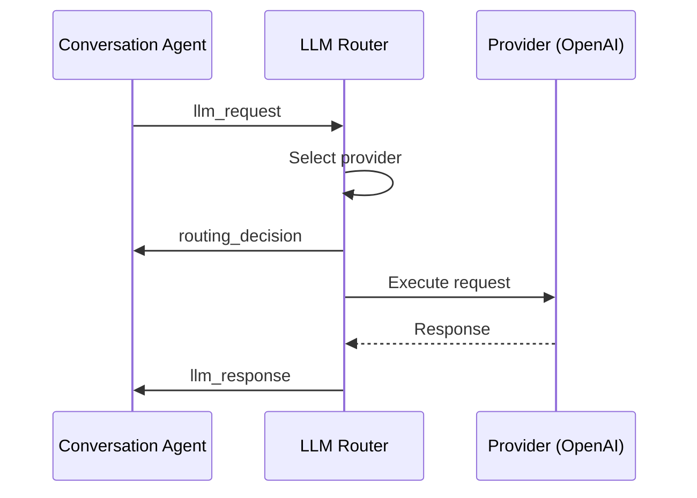
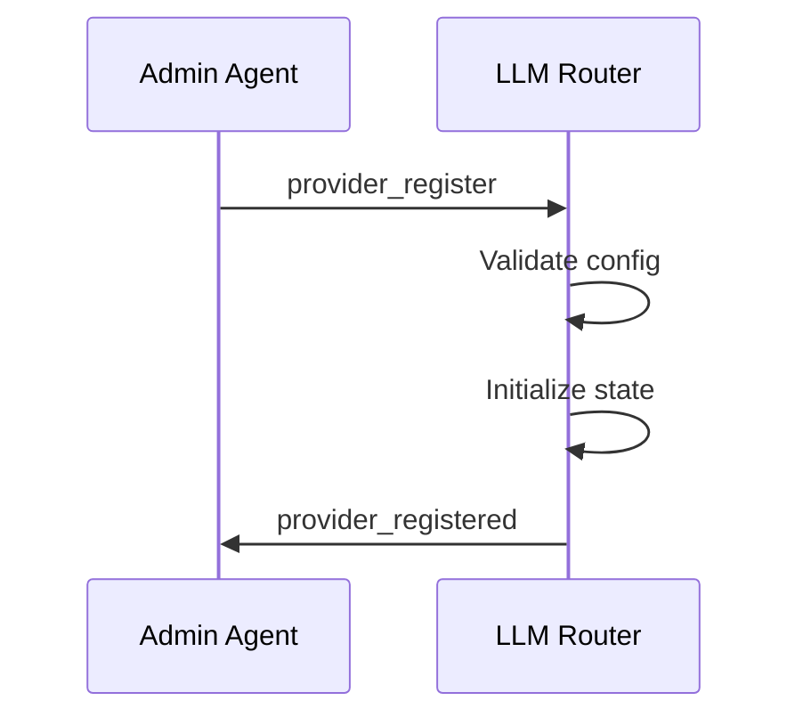
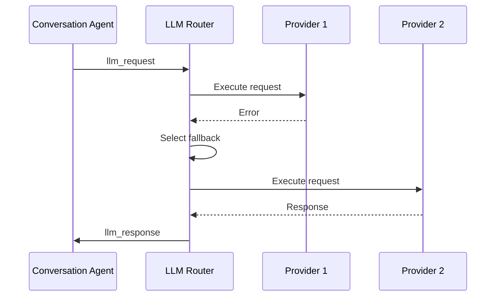

# LLM Router Agent Signal Documentation

## Overview

The LLM Router Agent manages LLM provider selection, load balancing, and request routing. It acts as an intelligent router between conversation agents and LLM providers.

## Input Signals

### llm_request
Routes an LLM request to the optimal provider.

```json
{
  "id": "unique-signal-id",
  "source": "conversation_agent_id",
  "type": "llm_request",
  "data": {
    "request_id": "req-123",
    "messages": [
      {"role": "system", "content": "You are a helpful assistant"},
      {"role": "user", "content": "Hello!"}
    ],
    "temperature": 0.7,
    "max_tokens": 1000,
    "user_id": "user-123",
    "conversation_id": "conv-456",
    "min_context_length": 8192,
    "max_response_tokens": 1000,
    "required_capabilities": ["chat", "code"],
    "max_latency_ms": 30000,
    "max_cost": 0.10,
    "preferences": {
      "preferred_providers": ["openai", "anthropic"],
      "avoid_providers": ["slow_provider"]
    }
  }
}
```

### provider_register
Registers a new LLM provider.

```json
{
  "id": "unique-signal-id",
  "source": "admin_agent",
  "type": "provider_register",
  "data": {
    "name": "openai",
    "config": {
      "api_key": "sk-...",
      "base_url": "https://api.openai.com",
      "models": ["gpt-4", "gpt-3.5-turbo"],
      "priority": 1,
      "rate_limit": {
        "limit": 100,
        "unit": "minute"
      },
      "max_retries": 3,
      "timeout": 30000,
      "headers": {
        "X-Custom-Header": "value"
      },
      "options": []
    }
  }
}
```

### provider_update
Updates an existing provider configuration.

```json
{
  "id": "unique-signal-id",
  "source": "admin_agent",
  "type": "provider_update",
  "data": {
    "name": "openai",
    "updates": {
      "models": ["gpt-4", "gpt-4-turbo", "gpt-3.5-turbo"],
      "priority": 2,
      "rate_limit": {
        "limit": 200,
        "unit": "minute"
      }
    }
  }
}
```

### provider_health
Updates health status for a provider.

```json
{
  "id": "unique-signal-id",
  "source": "health_monitor",
  "type": "provider_health",
  "data": {
    "provider": "openai",
    "status": "healthy",
    "latency_ms": 250,
    "timestamp": "2024-01-30T10:00:00Z"
  }
}
```

### get_routing_metrics
Requests current routing metrics.

```json
{
  "id": "unique-signal-id",
  "source": "monitoring_agent",
  "type": "get_routing_metrics",
  "data": {}
}
```

## Output Signals

### llm_response
Returns the LLM completion response.

```json
{
  "id": "unique-signal-id",
  "source": "llm_router_main",
  "type": "llm_response",
  "data": {
    "request_id": "req-123",
    "response": {
      "id": "resp-456",
      "choices": [
        {
          "message": {
            "role": "assistant",
            "content": "Hello! How can I help you today?"
          },
          "finish_reason": "stop",
          "index": 0
        }
      ],
      "usage": {
        "prompt_tokens": 10,
        "completion_tokens": 9,
        "total_tokens": 19
      },
      "model": "gpt-4",
      "created": 1706613600
    },
    "provider": "openai",
    "model": "gpt-4",
    "latency_ms": 523
  }
}
```

### llm_response (error)
Returns error when request fails.

```json
{
  "id": "unique-signal-id",
  "source": "llm_router_main",
  "type": "llm_response",
  "data": {
    "request_id": "req-123",
    "error": "No available provider: All providers are unhealthy",
    "provider": "openai"
  }
}
```

### routing_decision
Announces routing decision made.

```json
{
  "id": "unique-signal-id",
  "source": "llm_router_main",
  "type": "routing_decision",
  "data": {
    "request_id": "req-123",
    "provider": "openai",
    "model": "gpt-4",
    "strategy": "round_robin",
    "reason": "Selected based on round_robin strategy",
    "alternatives": ["anthropic/claude-3-sonnet", "local/llama-2"]
  }
}
```

### provider_registered
Confirms provider registration.

```json
{
  "id": "unique-signal-id",
  "source": "llm_router_main",
  "type": "provider_registered",
  "data": {
    "provider": "openai",
    "models": ["gpt-4", "gpt-3.5-turbo"],
    "status": "registered"
  }
}
```

### provider_registered (error)
Reports registration failure.

```json
{
  "id": "unique-signal-id",
  "source": "llm_router_main",
  "type": "provider_registered",
  "data": {
    "provider": "invalid_provider",
    "error": "Registration failed: Adapter module not found"
  }
}
```

### provider_updated
Confirms provider update.

```json
{
  "id": "unique-signal-id",
  "source": "llm_router_main",
  "type": "provider_updated",
  "data": {
    "provider": "openai",
    "status": "updated"
  }
}
```

### provider_metrics
Returns comprehensive provider metrics.

```json
{
  "id": "unique-signal-id",
  "source": "llm_router_main",
  "type": "provider_metrics",
  "data": {
    "total_requests": 1000,
    "active_requests": 5,
    "providers": [
      {
        "name": "openai",
        "status": "healthy",
        "models": ["gpt-4", "gpt-3.5-turbo"],
        "current_load": 3,
        "requests_handled": 500,
        "avg_latency_ms": 523.5,
        "error_rate": 0.02
      },
      {
        "name": "anthropic",
        "status": "healthy",
        "models": ["claude-3-sonnet"],
        "current_load": 2,
        "requests_handled": 450,
        "avg_latency_ms": 612.3,
        "error_rate": 0.01
      }
    ],
    "load_balancing_strategy": "round_robin",
    "total_cost": 125.50
  }
}
```

### cost_report
Reports cost tracking information.

```json
{
  "id": "unique-signal-id",
  "source": "llm_router_main",
  "type": "cost_report",
  "data": {
    "period": "hourly",
    "start_time": "2024-01-30T09:00:00Z",
    "end_time": "2024-01-30T10:00:00Z",
    "providers": {
      "openai": {
        "requests": 100,
        "tokens": {
          "prompt": 50000,
          "completion": 25000,
          "total": 75000
        },
        "cost": 2.25
      },
      "anthropic": {
        "requests": 80,
        "tokens": {
          "prompt": 40000,
          "completion": 20000,
          "total": 60000
        },
        "cost": 1.80
      }
    },
    "total_cost": 4.05
  }
}
```

## Signal Flow Examples

### Basic LLM Request Flow



### Provider Registration Flow



### Failover Flow



## Routing Strategies

### Round Robin
- Distributes requests evenly across providers
- Maintains provider index for next selection
- Ignores load and performance metrics

### Least Loaded
- Routes to provider with lowest current load
- Tracks active requests per provider
- Balances workload dynamically

### Cost Optimized
- Selects cheapest provider meeting requirements
- Considers token costs and request fees
- May sacrifice latency for cost

### Performance First
- Routes to provider with best latency
- Uses weighted average of recent latencies
- Prioritizes speed over cost

## Error Handling

### Provider Errors
- Automatic failover to next available provider
- Circuit breaker pattern for failing providers
- Exponential backoff for retries

### No Available Providers
- Returns error immediately
- Includes reason (all unhealthy, no matching capabilities, etc.)
- Suggests alternatives if possible

### Rate Limiting
- Tracks rate limits per provider
- Routes around rate-limited providers
- Returns specific rate limit errors when all providers limited