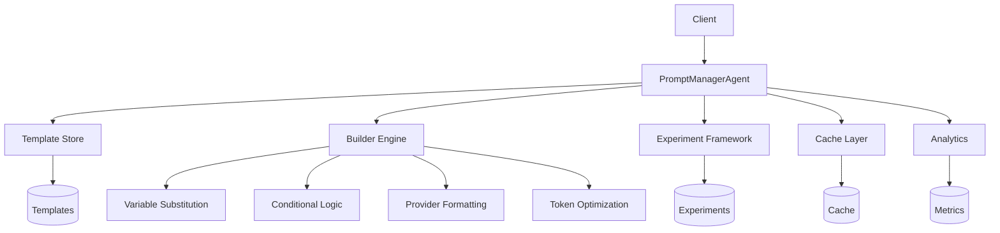
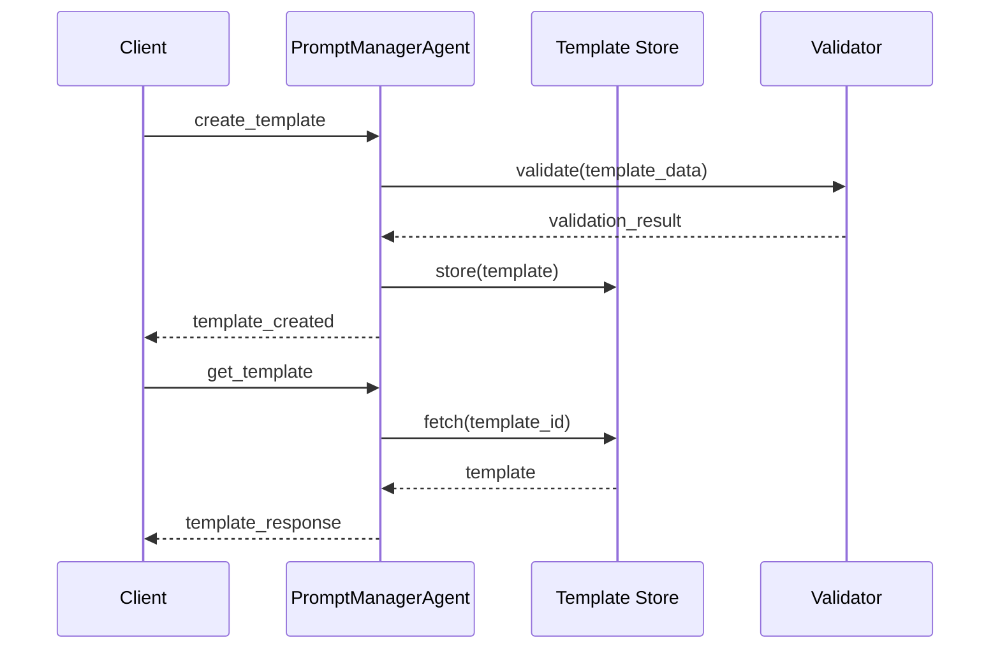
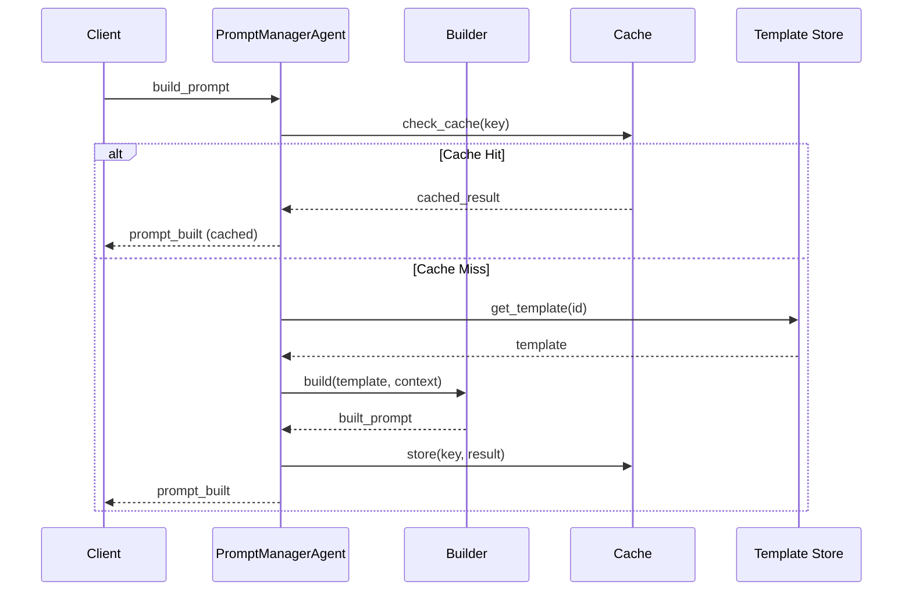
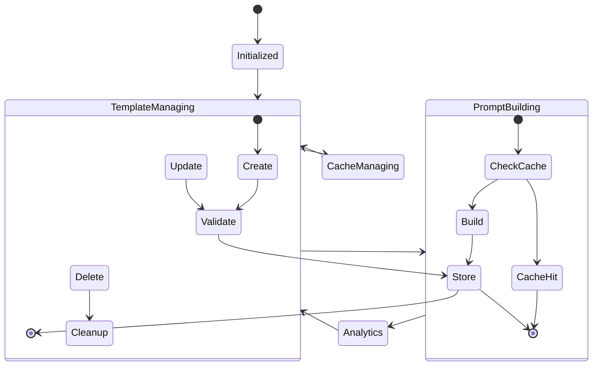
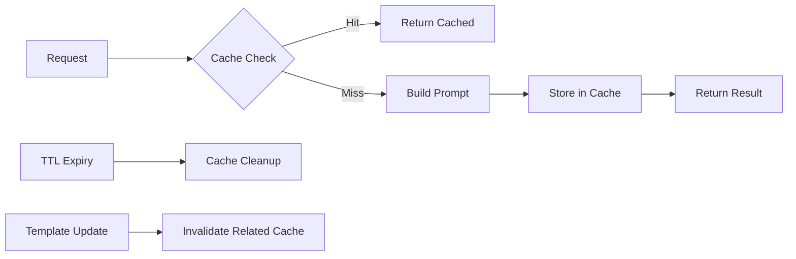
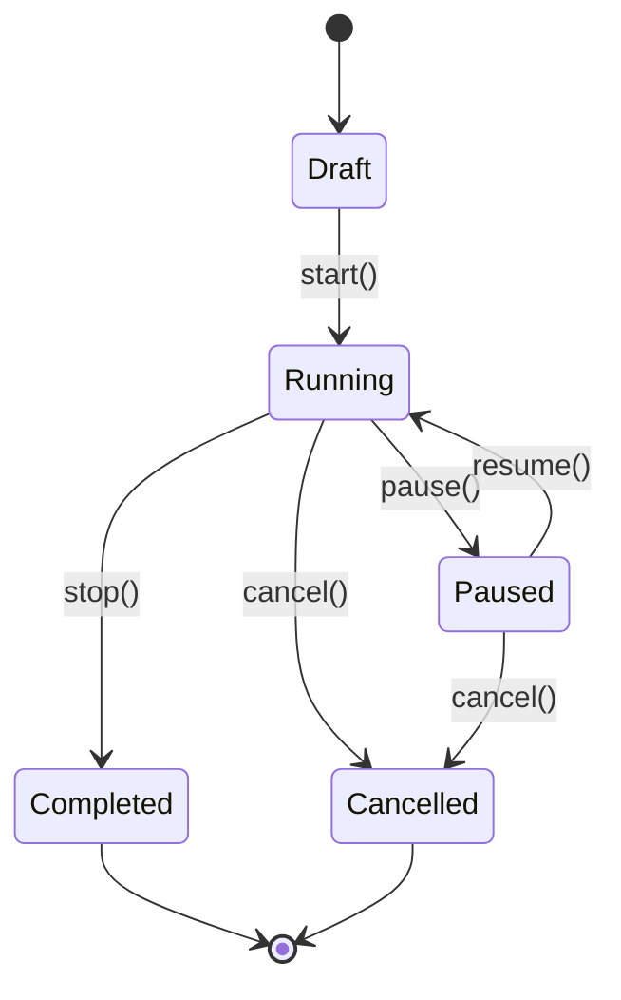
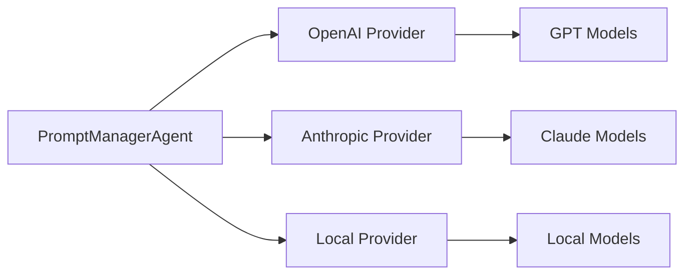

# Prompt Manager Agent Architecture

## Overview

The Prompt Manager Agent is a comprehensive system for managing prompt templates, enabling dynamic prompt construction, A/B testing, and performance analytics within the RubberDuck ecosystem. It serves as the central hub for all prompt-related operations, providing a robust foundation for LLM interactions.

## Architecture Components

### Core Modules

```
RubberDuck.Agents.PromptManagerAgent
├── Prompt.Template          # Template data structure and validation
├── Prompt.Builder           # Dynamic prompt construction engine
├── Prompt.Experiment        # A/B testing framework
└── Prompt.Analytics         # Performance tracking (future enhancement)
```

### System Design



## Signal Flow Architecture

### Template Management Signals



### Prompt Building Flow



## Data Structures

### Template Structure

```elixir
%Template{
  id: "uuid",
  name: "Human-readable name",
  description: "Template description",
  content: "Template with {{variables}}",
  variables: [
    %{
      name: "variable_name",
      type: :string | :integer | :float | :boolean | :list | :map,
      required: true | false,
      default: "default_value",
      description: "Variable description",
      validation: validation_rules
    }
  ],
  metadata: %{
    usage_count: 0,
    error_count: 0,
    success_rate: 0.0,
    avg_tokens: 0,
    last_used: nil
  },
  version: "1.0.0",
  created_at: ~U[2024-01-01 00:00:00Z],
  updated_at: ~U[2024-01-01 00:00:00Z],
  tags: ["tag1", "tag2"],
  category: "category_name",
  access_level: :public | :private | :team
}
```

### Experiment Structure

```elixir
%Experiment{
  id: "uuid",
  name: "A/B Test Name",
  description: "Test description",
  variants: [
    %{
      id: "variant_1",
      name: "Control",
      template_id: "template_uuid",
      weight: 0.5
    },
    %{
      id: "variant_2", 
      name: "Treatment",
      template_id: "template_uuid",
      weight: 0.5
    }
  ],
  traffic_split: %{"variant_1" => 0.5, "variant_2" => 0.5},
  metrics: [
    %{
      name: "success_rate",
      type: :success_rate,
      higher_is_better: true
    }
  ],
  status: :draft | :running | :paused | :completed | :cancelled,
  results: %{
    raw_data: [...],
    analysis: %{...}
  }
}
```

## Agent State Management

### State Structure

```elixir
%{
  templates: %{template_id => Template.t()},
  experiments: %{experiment_id => Experiment.t()},
  analytics: %{template_id => analytics_data},
  cache: %{cache_key => cache_entry},
  config: %{
    cache_ttl: 3600,
    max_templates: 1000,
    analytics_retention_days: 30,
    default_optimization: true
  }
}
```

### State Transitions



## Template System Architecture

### Variable Substitution Engine

The Builder module implements a sophisticated variable substitution system:

1. **Simple Variables**: `{{variable_name}}`
2. **Default Values**: `{{variable_name|default_value}}`
3. **Nested Access**: `{{user.name}}` or `{{config.settings.timeout}}`
4. **Type Conversion**: Automatic conversion of non-string types to strings

### Conditional Logic Support

```elixir
# If statements
"content"

# Unless statements  
"content"

# For loops
"{{item}}"

# Comparisons
"Running"
"Has items"
```

### Provider-Specific Formatting

The system supports formatting optimization for different LLM providers:

- **OpenAI**: GPT-specific message formatting, function call handling
- **Anthropic**: Claude-specific formatting, safety considerations
- **Local**: Simplified formatting for local models

## Caching Strategy

### Cache Architecture



### Cache Key Generation

Cache keys are generated using MD5 hash of:
- Template ID
- Context variables
- Build options
- Provider settings

### Cache Invalidation

- **Time-based**: TTL expiration (configurable, default 1 hour)
- **Event-based**: Template updates invalidate related cache entries
- **Manual**: Admin-triggered cache clearing

## A/B Testing Framework

### Experiment Lifecycle



### Statistical Analysis

The framework implements:
- **Sample Size Calculation**: Determines required participants for statistical significance
- **Variant Selection**: Weighted random selection based on traffic split
- **Significance Testing**: Statistical tests to determine winning variants
- **Confidence Intervals**: 95% and 99% confidence level support

## Performance Characteristics

### Scalability Metrics

| Operation | Complexity | Performance Target |
|-----------|------------|-------------------|
| Template Lookup | O(1) | < 1ms |
| Prompt Building | O(n) where n = variables | < 10ms |
| Cache Hit | O(1) | < 0.5ms |
| Template Validation | O(m) where m = content length | < 5ms |

### Memory Management

- **Template Storage**: In-memory HashMap for fast access
- **Cache Management**: LRU-style eviction based on TTL
- **Analytics Data**: Configurable retention period (default 30 days)

## Security Considerations

### Access Control

Templates support three access levels:
- **Public**: Available to all users
- **Private**: Only accessible by creator
- **Team**: Accessible by team members

### Input Validation

- Template content validation prevents injection attacks
- Variable type checking ensures data integrity
- Context sanitization for user-provided data

### Data Privacy

- No sensitive data stored in templates
- Context data not persisted beyond cache TTL
- Analytics data anonymized

## Integration Points

### Provider Agent Integration



### Signal Communication

The agent integrates with the RubberDuck signal system:
- **Inbound Signals**: Template management, prompt building requests
- **Outbound Signals**: Results, errors, status updates
- **Event Broadcasting**: Template updates, experiment results

## Monitoring and Observability

### Metrics Collection

- Template usage statistics
- Prompt building performance
- Cache hit/miss ratios
- Error rates and types
- A/B test performance

### Health Checks

- Agent responsiveness
- Memory usage monitoring
- Cache performance metrics
- Template validation status

## Future Enhancements

### Planned Features

1. **Machine Learning Integration**
   - Automatic prompt optimization based on performance data
   - Intelligent variable suggestion
   - Content quality scoring

2. **Advanced Analytics**
   - Real-time performance dashboards
   - Predictive analytics for prompt effectiveness
   - User behavior analysis

3. **Template Marketplace**
   - Community-contributed templates
   - Template rating and review system
   - Automated quality assessment

4. **Multi-language Support**
   - Template localization
   - Language-specific optimization
   - Cultural adaptation guidelines

### Technical Improvements

- **Streaming Support**: Real-time prompt building for large templates
- **Distributed Caching**: Redis integration for multi-node deployments
- **Advanced Templating**: More sophisticated conditional logic and loops
- **Performance Optimization**: Template compilation and caching strategies

## Development Guidelines

### Creating New Templates

1. Define clear variable requirements
2. Include comprehensive descriptions
3. Test with various contexts
4. Validate against target providers
5. Monitor usage and performance

### Extending the Builder

1. Maintain backward compatibility
2. Add comprehensive tests
3. Document new features
4. Consider performance implications
5. Follow existing patterns

### A/B Testing Best Practices

1. Define clear success metrics
2. Ensure sufficient sample sizes
3. Run experiments for adequate duration
4. Analyze results with proper statistical methods
5. Document findings and recommendations

This architecture provides a robust, scalable foundation for prompt management in the RubberDuck system, enabling sophisticated prompt engineering workflows while maintaining high performance and reliability.