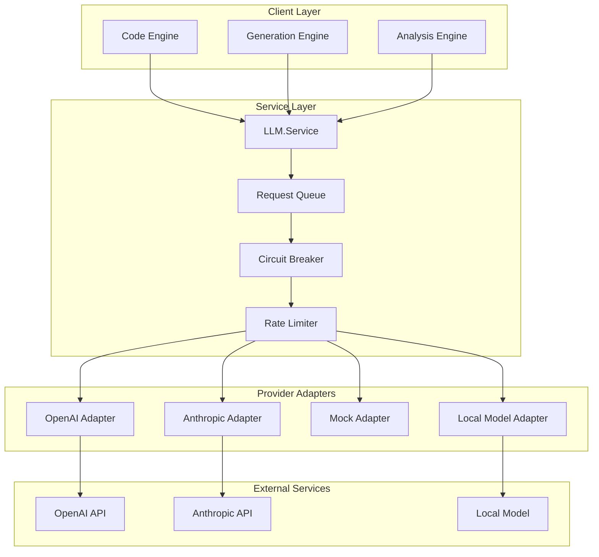

# RubberDuck Provider Adapters System - Comprehensive Guide

## Table of Contents
1. [Introduction](#introduction)
2. [Architecture Overview](#architecture-overview)
3. [Core Components](#core-components)
4. [Provider Adapter Pattern](#provider-adapter-pattern)
5. [Implementing a Provider Adapter](#implementing-a-provider-adapter)
6. [Service Layer Architecture](#service-layer-architecture)
7. [Advanced Features](#advanced-features)
8. [Usage Examples](#usage-examples)
9. [Testing Strategies](#testing-strategies)
10. [Best Practices](#best-practices)
11. [Troubleshooting](#troubleshooting)

## Introduction

The RubberDuck Provider Adapters System is a sophisticated, fault-tolerant abstraction layer that enables seamless integration with multiple Large Language Model (LLM) providers. Built with Elixir's OTP principles, it provides a unified interface for interacting with different AI services while handling the complexities of rate limiting, failover, circuit breaking, and cost tracking.

### Key Design Principles

1. **Provider Agnostic**: Applications interact with a unified interface regardless of the underlying LLM provider
2. **Fault Tolerance**: Automatic failover between providers with circuit breaker patterns
3. **Scalability**: Concurrent request handling with intelligent queuing
4. **Observability**: Comprehensive metrics and cost tracking
5. **Extensibility**: Easy addition of new providers through a well-defined behavior

## Architecture Overview



## Core Components

### 1. Provider Behavior

The foundation of the adapter system is a well-defined behavior that all providers must implement:

```elixir
defmodule RubberDuck.LLM.Provider do
  @moduledoc """
  Behavior definition for LLM providers.
  """
  
  @type config :: keyword()
  @type request :: %{
    model: String.t(),
    messages: [message()],
    temperature: float(),
    max_tokens: integer(),
    stream: boolean(),
    optional(:functions) => [function_def()],
    optional(:system) => String.t()
  }
  
  @type message :: %{
    role: :system | :user | :assistant | :function,
    content: String.t(),
    optional(:name) => String.t(),
    optional(:function_call) => map()
  }
  
  @type response :: %{
    id: String.t(),
    model: String.t(),
    choices: [choice()],
    usage: usage(),
    created: integer()
  }
  
  @type choice :: %{
    index: integer(),
    message: message(),
    finish_reason: String.t()
  }
  
  @type usage :: %{
    prompt_tokens: integer(),
    completion_tokens: integer(),
    total_tokens: integer(),
    cost: float()
  }
  
  @type error :: {:error, term()}
  
  @callback init(config()) :: {:ok, state :: term()} | error()
  @callback complete(request(), state :: term()) :: {:ok, response()} | error()
  @callback stream(request(), state :: term()) :: {:ok, Enumerable.t()} | error()
  @callback count_tokens(String.t(), model :: String.t()) :: {:ok, integer()} | error()
  @callback supports_model?(String.t()) :: boolean()
  @callback estimate_cost(usage(), model :: String.t()) :: float()
end
```

### 2. Service GenServer

The main service orchestrates all provider interactions:

```elixir
defmodule RubberDuck.LLM.Service do
  use GenServer
  require Logger
  
  defmodule State do
    defstruct [
      :providers,
      :circuit_breakers,
      :rate_limiters,
      :request_queue,
      :metrics,
      :config
    ]
  end
  
  # Client API
  
  def start_link(opts) do
    GenServer.start_link(__MODULE__, opts, name: __MODULE__)
  end
  
  def complete(request, opts \\ []) do
    GenServer.call(__MODULE__, {:complete, request, opts}, :infinity)
  end
  
  def stream(request, opts \\ []) do
    GenServer.call(__MODULE__, {:stream, request, opts}, :infinity)
  end
  
  # Server Callbacks
  
  @impl true
  def init(opts) do
    state = %State{
      providers: init_providers(opts[:providers] || []),
      circuit_breakers: init_circuit_breakers(),
      rate_limiters: init_rate_limiters(opts[:rate_limits] || []),
      request_queue: :queue.new(),
      metrics: init_metrics(),
      config: opts
    }
    
    schedule_queue_processing()
    {:ok, state}
  end
  
  @impl true
  def handle_call({:complete, request, opts}, from, state) do
    case select_provider(request.model, state) do
      {:ok, provider} ->
        enqueue_request({:complete, request, provider, from, opts}, state)
      {:error, reason} ->
        {:reply, {:error, reason}, state}
    end
  end
  
  defp select_provider(model, %State{providers: providers, circuit_breakers: breakers}) do
    providers
    |> Enum.filter(fn {_name, provider} -> 
      provider.module.supports_model?(model)
    end)
    |> Enum.reject(fn {name, _provider} ->
      CircuitBreaker.open?(breakers[name])
    end)
    |> Enum.sort_by(fn {name, _provider} ->
      # Sort by priority, health score, current load
      calculate_provider_score(name, state)
    end)
    |> List.first()
    |> case do
      {name, provider} -> {:ok, {name, provider}}
      nil -> {:error, :no_available_provider}
    end
  end
end
```

## Provider Adapter Pattern

### OpenAI Adapter Implementation

```elixir
defmodule RubberDuck.LLM.Providers.OpenAI do
  @behaviour RubberDuck.LLM.Provider
  
  @base_url "https://api.openai.com/v1"
  @models ~w(gpt-4 gpt-4-turbo gpt-4o gpt-3.5-turbo)
  
  defstruct [:api_key, :organization, :http_client]
  
  @impl true
  def init(config) do
    state = %__MODULE__{
      api_key: config[:api_key] || System.get_env("OPENAI_API_KEY"),
      organization: config[:organization],
      http_client: config[:http_client] || Req
    }
    
    if state.api_key do
      {:ok, state}
    else
      {:error, :missing_api_key}
    end
  end
  
  @impl true
  def complete(request, state) do
    body = build_request_body(request)
    headers = build_headers(state)
    
    case state.http_client.post("#{@base_url}/chat/completions", 
                                json: body, 
                                headers: headers) do
      {:ok, %{status: 200, body: body}} ->
        {:ok, parse_response(body)}
      
      {:ok, %{status: status, body: body}} when status in 400..499 ->
        {:error, parse_error(body)}
      
      {:ok, %{status: status}} when status in 500..599 ->
        {:error, :service_unavailable}
      
      {:error, reason} ->
        {:error, reason}
    end
  end
  
  @impl true
  def stream(request, state) do
    request = Map.put(request, :stream, true)
    body = build_request_body(request)
    headers = build_headers(state)
    
    stream = Stream.resource(
      fn -> start_streaming(body, headers, state) end,
      &read_chunk/1,
      &cleanup_stream/1
    )
    
    {:ok, stream}
  end
  
  @impl true
  def count_tokens(text, model) do
    # Use tiktoken or similar library
    {:ok, TokenCounter.count(text, model)}
  end
  
  @impl true
  def supports_model?(model), do: model in @models
  
  @impl true
  def estimate_cost(usage, model) do
    pricing = %{
      "gpt-4" => %{input: 0.03, output: 0.06},
      "gpt-4-turbo" => %{input: 0.01, output: 0.03},
      "gpt-4o" => %{input: 0.005, output: 0.015},
      "gpt-3.5-turbo" => %{input: 0.0005, output: 0.0015}
    }
    
    model_pricing = pricing[model] || pricing["gpt-3.5-turbo"]
    
    input_cost = (usage.prompt_tokens / 1000) * model_pricing.input
    output_cost = (usage.completion_tokens / 1000) * model_pricing.output
    
    input_cost + output_cost
  end
  
  # Private functions
  
  defp build_request_body(request) do
    %{
      model: request.model,
      messages: format_messages(request.messages),
      temperature: request[:temperature] || 0.7,
      max_tokens: request[:max_tokens],
      stream: request[:stream] || false
    }
    |> maybe_add_functions(request)
    |> maybe_add_tools(request)
  end
  
  defp format_messages(messages) do
    Enum.map(messages, fn message ->
      %{
        role: to_string(message.role),
        content: message.content
      }
      |> maybe_add_name(message)
      |> maybe_add_function_call(message)
    end)
  end
  
  defp build_headers(state) do
    headers = [
      {"Authorization", "Bearer #{state.api_key}"},
      {"Content-Type", "application/json"}
    ]
    
    if state.organization do
      [{"OpenAI-Organization", state.organization} | headers]
    else
      headers
    end
  end
end
```

### Anthropic Adapter Implementation

```elixir
defmodule RubberDuck.LLM.Providers.Anthropic do
  @behaviour RubberDuck.LLM.Provider
  
  @base_url "https://api.anthropic.com/v1"
  @models ~w(claude-3-opus claude-3-sonnet claude-3-haiku)
  
  defstruct [:api_key, :http_client, :anthropic_version]
  
  @impl true
  def init(config) do
    state = %__MODULE__{
      api_key: config[:api_key] || System.get_env("ANTHROPIC_API_KEY"),
      http_client: config[:http_client] || Req,
      anthropic_version: config[:version] || "2023-06-01"
    }
    
    if state.api_key do
      {:ok, state}
    else
      {:error, :missing_api_key}
    end
  end
  
  @impl true
  def complete(request, state) do
    body = build_anthropic_request(request)
    headers = build_headers(state)
    
    case state.http_client.post("#{@base_url}/messages", 
                                json: body, 
                                headers: headers) do
      {:ok, %{status: 200, body: body}} ->
        {:ok, normalize_response(body)}
      
      {:ok, %{status: status, body: body}} ->
        {:error, parse_anthropic_error(body)}
      
      {:error, reason} ->
        {:error, reason}
    end
  end
  
  defp build_anthropic_request(request) do
    {system_messages, other_messages} = 
      Enum.split_with(request.messages, &(&1.role == :system))
    
    %{
      model: request.model,
      messages: format_anthropic_messages(other_messages),
      max_tokens: request[:max_tokens] || 1024,
      temperature: request[:temperature] || 0.7
    }
    |> maybe_add_system(system_messages)
  end
  
  defp format_anthropic_messages(messages) do
    messages
    |> Enum.map(fn message ->
      %{
        role: anthropic_role(message.role),
        content: message.content
      }
    end)
  end
  
  defp anthropic_role(:user), do: "user"
  defp anthropic_role(:assistant), do: "assistant"
  defp anthropic_role(other), do: to_string(other)
  
  defp normalize_response(anthropic_response) do
    # Convert Anthropic response format to unified format
    %{
      id: anthropic_response["id"],
      model: anthropic_response["model"],
      choices: [
        %{
          index: 0,
          message: %{
            role: :assistant,
            content: anthropic_response["content"] |> Enum.at(0) |> Map.get("text", "")
          },
          finish_reason: anthropic_response["stop_reason"]
        }
      ],
      usage: %{
        prompt_tokens: anthropic_response["usage"]["input_tokens"],
        completion_tokens: anthropic_response["usage"]["output_tokens"],
        total_tokens: anthropic_response["usage"]["input_tokens"] + 
                      anthropic_response["usage"]["output_tokens"]
      }
    }
  end
end
```

## Service Layer Architecture

### Circuit Breaker Implementation

```elixir
defmodule RubberDuck.LLM.CircuitBreaker do
  use GenServer
  
  defmodule State do
    defstruct [
      :name,
      :failure_threshold,
      :reset_timeout,
      :failure_count,
      :last_failure_time,
      :state,  # :closed, :open, :half_open
      :success_threshold
    ]
  end
  
  def start_link(opts) do
    GenServer.start_link(__MODULE__, opts, name: via_tuple(opts[:name]))
  end
  
  def call(name, fun) do
    GenServer.call(via_tuple(name), {:call, fun})
  end
  
  def open?(name) do
    GenServer.call(via_tuple(name), :is_open?)
  end
  
  # Server implementation
  
  @impl true
  def init(opts) do
    state = %State{
      name: opts[:name],
      failure_threshold: opts[:failure_threshold] || 5,
      reset_timeout: opts[:reset_timeout] || 60_000,
      failure_count: 0,
      state: :closed,
      success_threshold: opts[:success_threshold] || 3
    }
    
    {:ok, state}
  end
  
  @impl true
  def handle_call({:call, fun}, _from, %State{state: :open} = state) do
    if should_attempt_reset?(state) do
      attempt_call(fun, %{state | state: :half_open})
    else
      {:reply, {:error, :circuit_open}, state}
    end
  end
  
  def handle_call({:call, fun}, _from, state) do
    attempt_call(fun, state)
  end
  
  defp attempt_call(fun, state) do
    case fun.() do
      {:ok, result} ->
        new_state = handle_success(state)
        {:reply, {:ok, result}, new_state}
      
      {:error, reason} ->
        new_state = handle_failure(state)
        {:reply, {:error, reason}, new_state}
    end
  rescue
    error ->
      new_state = handle_failure(state)
      {:reply, {:error, error}, new_state}
  end
  
  defp handle_success(%State{state: :half_open} = state) do
    %{state | state: :closed, failure_count: 0}
  end
  
  defp handle_success(state), do: state
  
  defp handle_failure(%State{failure_count: count, failure_threshold: threshold} = state)
       when count + 1 >= threshold do
    %{state | 
      state: :open, 
      failure_count: count + 1,
      last_failure_time: System.monotonic_time(:millisecond)
    }
  end
  
  defp handle_failure(%State{failure_count: count} = state) do
    %{state | failure_count: count + 1}
  end
end
```

### Rate Limiter Implementation

```elixir
defmodule RubberDuck.LLM.RateLimiter do
  use GenServer
  
  defmodule TokenBucket do
    defstruct [
      :capacity,
      :tokens,
      :refill_rate,
      :last_refill
    ]
    
    def new(capacity, refill_rate) do
      %__MODULE__{
        capacity: capacity,
        tokens: capacity,
        refill_rate: refill_rate,
        last_refill: System.monotonic_time(:millisecond)
      }
    end
    
    def take(bucket, tokens_requested) do
      bucket = refill(bucket)
      
      if bucket.tokens >= tokens_requested do
        {:ok, %{bucket | tokens: bucket.tokens - tokens_requested}}
      else
        {:error, :rate_limited}
      end
    end
    
    def refill(%__MODULE__{} = bucket) do
      now = System.monotonic_time(:millisecond)
      elapsed = now - bucket.last_refill
      tokens_to_add = (elapsed / 1000) * bucket.refill_rate
      
      new_tokens = min(bucket.capacity, bucket.tokens + tokens_to_add)
      
      %{bucket | tokens: new_tokens, last_refill: now}
    end
  end
  
  def start_link(opts) do
    GenServer.start_link(__MODULE__, opts, name: __MODULE__)
  end
  
  def check_rate(provider, tokens \\ 1) do
    GenServer.call(__MODULE__, {:check_rate, provider, tokens})
  end
  
  @impl true
  def init(opts) do
    buckets = 
      opts
      |> Keyword.get(:limits, [])
      |> Enum.into(%{}, fn {provider, config} ->
        {provider, TokenBucket.new(config[:capacity], config[:refill_rate])}
      end)
    
    {:ok, %{buckets: buckets}}
  end
  
  @impl true
  def handle_call({:check_rate, provider, tokens}, _from, state) do
    case Map.get(state.buckets, provider) do
      nil ->
        {:reply, :ok, state}
      
      bucket ->
        case TokenBucket.take(bucket, tokens) do
          {:ok, new_bucket} ->
            new_buckets = Map.put(state.buckets, provider, new_bucket)
            {:reply, :ok, %{state | buckets: new_buckets}}
          
          {:error, :rate_limited} = error ->
            {:reply, error, state}
        end
    end
  end
end
```

## Advanced Features

### Request Queue Management

```elixir
defmodule RubberDuck.LLM.RequestQueue do
  use GenServer
  
  defmodule Request do
    defstruct [
      :id,
      :payload,
      :priority,
      :timestamp,
      :from,
      :attempts,
      :provider
    ]
  end
  
  def start_link(opts) do
    GenServer.start_link(__MODULE__, opts, name: __MODULE__)
  end
  
  def enqueue(request, priority \\ :normal) do
    GenServer.cast(__MODULE__, {:enqueue, request, priority})
  end
  
  def process_next do
    GenServer.call(__MODULE__, :process_next)
  end
  
  @impl true
  def init(_opts) do
    {:ok, %{
      high: :queue.new(),
      normal: :queue.new(),
      low: :queue.new(),
      processing: %{},
      stats: %{enqueued: 0, processed: 0, failed: 0}
    }}
  end
  
  @impl true
  def handle_cast({:enqueue, request, priority}, state) do
    queue = Map.get(state, priority, state.normal)
    new_queue = :queue.in(request, queue)
    
    new_state = 
      state
      |> Map.put(priority, new_queue)
      |> update_in([:stats, :enqueued], &(&1 + 1))
    
    {:noreply, new_state}
  end
  
  @impl true
  def handle_call(:process_next, _from, state) do
    case get_next_request(state) do
      {:ok, request, new_state} ->
        {:reply, {:ok, request}, new_state}
      
      :empty ->
        {:reply, :empty, state}
    end
  end
  
  defp get_next_request(state) do
    # Check queues in priority order
    [:high, :normal, :low]
    |> Enum.find_value(fn priority ->
      queue = Map.get(state, priority)
      case :queue.out(queue) do
        {{:value, request}, new_queue} ->
          new_state = Map.put(state, priority, new_queue)
          {:ok, request, new_state}
        
        {:empty, _} ->
          nil
      end
    end) || :empty
  end
end
```

### Cost Tracking

```elixir
defmodule RubberDuck.LLM.CostTracker do
  use GenServer
  
  def start_link(opts) do
    GenServer.start_link(__MODULE__, opts, name: __MODULE__)
  end
  
  def track(provider, model, usage) do
    GenServer.cast(__MODULE__, {:track, provider, model, usage})
  end
  
  def get_summary(timeframe \\ :all) do
    GenServer.call(__MODULE__, {:get_summary, timeframe})
  end
  
  @impl true
  def init(_opts) do
    {:ok, %{
      costs: %{},
      daily_costs: %{},
      hourly_costs: %{}
    }}
  end
  
  @impl true
  def handle_cast({:track, provider, model, usage}, state) do
    cost = calculate_cost(provider, model, usage)
    timestamp = DateTime.utc_now()
    
    new_state = 
      state
      |> track_total_cost(provider, model, cost, usage)
      |> track_daily_cost(provider, model, cost, timestamp)
      |> track_hourly_cost(provider, model, cost, timestamp)
    
    # Emit telemetry event
    :telemetry.execute(
      [:rubber_duck, :llm, :cost],
      %{cost: cost, tokens: usage.total_tokens},
      %{provider: provider, model: model}
    )
    
    {:noreply, new_state}
  end
  
  @impl true
  def handle_call({:get_summary, timeframe}, _from, state) do
    summary = build_summary(state, timeframe)
    {:reply, summary, state}
  end
  
  defp calculate_cost("openai", model, usage) do
    RubberDuck.LLM.Providers.OpenAI.estimate_cost(usage, model)
  end
  
  defp calculate_cost("anthropic", model, usage) do
    RubberDuck.LLM.Providers.Anthropic.estimate_cost(usage, model)
  end
  
  defp track_total_cost(state, provider, model, cost, usage) do
    key = {provider, model}
    
    update_in(state, [:costs, key], fn current ->
      current = current || %{cost: 0.0, tokens: 0}
      %{
        cost: current.cost + cost,
        tokens: current.tokens + usage.total_tokens
      }
    end)
  end
end
```

## Usage Examples

### Basic Usage

```elixir
# Start the LLM service
{:ok, _pid} = RubberDuck.LLM.Service.start_link(
  providers: [
    openai: [
      module: RubberDuck.LLM.Providers.OpenAI,
      api_key: System.get_env("OPENAI_API_KEY")
    ],
    anthropic: [
      module: RubberDuck.LLM.Providers.Anthropic,
      api_key: System.get_env("ANTHROPIC_API_KEY")
    ]
  ],
  rate_limits: [
    openai: [capacity: 100, refill_rate: 10],
    anthropic: [capacity: 50, refill_rate: 5]
  ]
)

# Make a completion request
request = %{
  model: "gpt-4",
  messages: [
    %{role: :system, content: "You are a helpful coding assistant."},
    %{role: :user, content: "Write a function to calculate fibonacci numbers in Elixir"}
  ],
  temperature: 0.7,
  max_tokens: 500
}

case RubberDuck.LLM.Service.complete(request) do
  {:ok, response} ->
    IO.puts(response.choices |> List.first() |> Map.get(:message) |> Map.get(:content))
    IO.puts("Tokens used: #{response.usage.total_tokens}")
    IO.puts("Cost: $#{response.usage.cost}")
  
  {:error, reason} ->
    IO.puts("Error: #{inspect(reason)}")
end
```

### Streaming Usage

```elixir
# Stream a response
request = %{
  model: "claude-3-sonnet",
  messages: [
    %{role: :user, content: "Explain the Elixir actor model in detail"}
  ],
  stream: true
}

case RubberDuck.LLM.Service.stream(request) do
  {:ok, stream} ->
    stream
    |> Stream.each(fn chunk ->
      IO.write(chunk.delta.content)
    end)
    |> Stream.run()
  
  {:error, reason} ->
    IO.puts("Streaming error: #{inspect(reason)}")
end
```

### Advanced Configuration

```elixir
# Configure with fallback preferences
config = [
  providers: [
    primary: [
      module: RubberDuck.LLM.Providers.OpenAI,
      api_key: System.get_env("OPENAI_API_KEY"),
      priority: 1
    ],
    fallback: [
      module: RubberDuck.LLM.Providers.Anthropic,
      api_key: System.get_env("ANTHROPIC_API_KEY"),
      priority: 2
    ],
    local: [
      module: RubberDuck.LLM.Providers.LocalModel,
      model_path: "/path/to/model",
      priority: 3
    ]
  ],
  circuit_breaker: [
    failure_threshold: 5,
    reset_timeout: 60_000,
    success_threshold: 3
  ],
  retry: [
    max_attempts: 3,
    base_delay: 1000,
    max_delay: 10_000,
    jitter: true
  ]
]

{:ok, _pid} = RubberDuck.LLM.Service.start_link(config)
```

## Testing Strategies

### Unit Testing Providers

```elixir
defmodule RubberDuck.LLM.Providers.OpenAITest do
  use ExUnit.Case, async: true
  import Mox
  
  setup :verify_on_exit!
  
  describe "complete/2" do
    test "successfully completes a request" do
      # Mock HTTP client
      MockHTTPClient
      |> expect(:post, fn url, opts ->
        assert url == "https://api.openai.com/v1/chat/completions"
        assert opts[:json][:model] == "gpt-4"
        
        {:ok, %{
          status: 200,
          body: %{
            "id" => "chatcmpl-123",
            "choices" => [
              %{
                "index" => 0,
                "message" => %{
                  "role" => "assistant",
                  "content" => "Hello!"
                },
                "finish_reason" => "stop"
              }
            ],
            "usage" => %{
              "prompt_tokens" => 10,
              "completion_tokens" => 20,
              "total_tokens" => 30
            }
          }
        }}
      end)
      
      provider = %RubberDuck.LLM.Providers.OpenAI{
        api_key: "test-key",
        http_client: MockHTTPClient
      }
      
      request = %{
        model: "gpt-4",
        messages: [%{role: :user, content: "Hi"}]
      }
      
      assert {:ok, response} = RubberDuck.LLM.Providers.OpenAI.complete(request, provider)
      assert response.choices |> List.first() |> Map.get(:message) |> Map.get(:content) == "Hello!"
    end
    
    test "handles rate limiting gracefully" do
      MockHTTPClient
      |> expect(:post, fn _url, _opts ->
        {:ok, %{
          status: 429,
          body: %{
            "error" => %{
              "message" => "Rate limit exceeded",
              "type" => "rate_limit_error"
            }
          }
        }}
      end)
      
      # Test implementation...
    end
  end
end
```

### Integration Testing

```elixir
defmodule RubberDuck.LLM.ServiceIntegrationTest do
  use ExUnit.Case
  
  @moduletag :integration
  
  setup do
    # Start service with mock provider
    {:ok, pid} = RubberDuck.LLM.Service.start_link(
      providers: [
        mock: [
          module: RubberDuck.LLM.Providers.Mock,
          responses: [
            %{content: "Test response", tokens: 100}
          ]
        ]
      ]
    )
    
    on_exit(fn -> GenServer.stop(pid) end)
    
    :ok
  end
  
  test "complete request with fallback" do
    request = %{
      model: "gpt-4",
      messages: [%{role: :user, content: "Test"}]
    }
    
    assert {:ok, response} = RubberDuck.LLM.Service.complete(request)
    assert response.choices |> List.first() |> Map.get(:message) |> Map.get(:content) == "Test response"
  end
end
```

## Best Practices

### 1. Provider Configuration

```elixir
# Use environment-specific configuration
config :rubber_duck, :llm_providers,
  openai: [
    api_key: {:system, "OPENAI_API_KEY"},
    organization: {:system, "OPENAI_ORG", nil},
    timeout: 30_000
  ],
  anthropic: [
    api_key: {:system, "ANTHROPIC_API_KEY"},
    version: "2023-06-01"
  ]

# Runtime configuration
defmodule RubberDuck.Config do
  def llm_config do
    :rubber_duck
    |> Application.get_env(:llm_providers, [])
    |> Enum.map(fn {provider, opts} ->
      {provider, resolve_config(opts)}
    end)
  end
  
  defp resolve_config(opts) do
    Enum.map(opts, fn
      {key, {:system, env_var}} ->
        {key, System.get_env(env_var)}
      
      {key, {:system, env_var, default}} ->
        {key, System.get_env(env_var, default)}
      
      other ->
        other
    end)
  end
end
```

### 2. Error Handling

```elixir
defmodule RubberDuck.LLM.ErrorHandler do
  require Logger
  
  def handle_provider_error({:error, %{"error" => %{"type" => "insufficient_quota"}}}) do
    Logger.error("Provider quota exceeded")
    {:error, :quota_exceeded}
  end
  
  def handle_provider_error({:error, %{"error" => %{"type" => "invalid_request_error"}}}) do
    {:error, :invalid_request}
  end
  
  def handle_provider_error({:error, :timeout}) do
    Logger.warn("Provider request timed out")
    {:error, :timeout}
  end
  
  def handle_provider_error({:error, reason}) do
    Logger.error("Unknown provider error: #{inspect(reason)}")
    {:error, :unknown_error}
  end
end
```

### 3. Monitoring and Metrics

```elixir
defmodule RubberDuck.LLM.Telemetry do
  def setup do
    # Attach telemetry handlers
    :telemetry.attach_many(
      "rubber-duck-llm-metrics",
      [
        [:rubber_duck, :llm, :request, :start],
        [:rubber_duck, :llm, :request, :stop],
        [:rubber_duck, :llm, :request, :exception],
        [:rubber_duck, :llm, :cost]
      ],
      &handle_event/4,
      nil
    )
  end
  
  defp handle_event([:rubber_duck, :llm, :request, :start], measurements, metadata, _) do
    Logger.info("LLM request started", 
      provider: metadata.provider,
      model: metadata.model
    )
  end
  
  defp handle_event([:rubber_duck, :llm, :request, :stop], measurements, metadata, _) do
    Logger.info("LLM request completed",
      provider: metadata.provider,
      model: metadata.model,
      duration_ms: measurements.duration / 1_000_000,
      tokens: metadata.tokens
    )
    
    # Send to monitoring service
    StatsD.histogram("llm.request.duration", measurements.duration / 1_000_000,
      tags: ["provider:#{metadata.provider}", "model:#{metadata.model}"]
    )
  end
  
  defp handle_event([:rubber_duck, :llm, :cost], measurements, metadata, _) do
    StatsD.gauge("llm.cost", measurements.cost,
      tags: ["provider:#{metadata.provider}", "model:#{metadata.model}"]
    )
  end
end
```

## Troubleshooting

### Common Issues and Solutions

#### 1. Circuit Breaker Keeps Opening

```elixir
# Increase failure threshold or decrease reset timeout
config :rubber_duck, :circuit_breaker,
  failure_threshold: 10,  # Increase from 5
  reset_timeout: 30_000,  # Decrease from 60_000
  success_threshold: 2    # Decrease from 3
```

#### 2. Rate Limiting Too Aggressive

```elixir
# Adjust token bucket parameters
config :rubber_duck, :rate_limits,
  openai: [
    capacity: 200,      # Increase capacity
    refill_rate: 20     # Increase refill rate
  ]
```

#### 3. Memory Usage from Request Queue

```elixir
# Implement queue size limits
defmodule RubberDuck.LLM.RequestQueue do
  @max_queue_size 1000
  
  def enqueue(request, priority) do
    current_size = get_queue_size()
    
    if current_size >= @max_queue_size do
      {:error, :queue_full}
    else
      # Normal enqueue logic
    end
  end
end
```

#### 4. Debugging Provider Issues

```elixir
# Enable debug logging for specific providers
config :logger, :console,
  format: "$time $metadata[$level] $message\n",
  metadata: [:provider, :model, :request_id]

# Add request/response logging
defmodule RubberDuck.LLM.Debug do
  def log_request(provider, request) do
    if Application.get_env(:rubber_duck, :debug_llm_requests) do
      Logger.debug("LLM Request",
        provider: provider,
        request: inspect(request, pretty: true)
      )
    end
  end
  
  def log_response(provider, response) do
    if Application.get_env(:rubber_duck, :debug_llm_responses) do
      Logger.debug("LLM Response",
        provider: provider,
        response: inspect(response, pretty: true)
      )
    end
  end
end
```

### Performance Optimization

```elixir
# Connection pooling for HTTP clients
config :req,
  default_options: [
    pool_options: [
      size: 50,
      count: 1,
      max_idle_time: 30_000
    ]
  ]

# Caching frequent requests
defmodule RubberDuck.LLM.Cache do
  use Nebulex.Cache,
    otp_app: :rubber_duck,
    adapter: Nebulex.Adapters.Local
  
  def cached_complete(request, ttl \\ :timer.minutes(5)) do
    key = generate_cache_key(request)
    
    case get(key) do
      nil ->
        case RubberDuck.LLM.Service.complete(request) do
          {:ok, response} = result ->
            put(key, response, ttl: ttl)
            result
          
          error ->
            error
        end
      
      cached_response ->
        {:ok, cached_response}
    end
  end
  
  defp generate_cache_key(request) do
    :crypto.hash(:sha256, :erlang.term_to_binary(request))
    |> Base.encode16()
  end
end
```

## Conclusion

The RubberDuck Provider Adapters System provides a robust, scalable foundation for integrating multiple LLM providers into your Elixir application. By leveraging OTP principles and Elixir's concurrency model, it delivers:

- **Reliability**: Circuit breakers and fallback mechanisms ensure high availability
- **Performance**: Concurrent request handling and intelligent queuing
- **Observability**: Comprehensive metrics and cost tracking
- **Extensibility**: Easy addition of new providers through well-defined behaviors
- **Developer Experience**: Unified interface regardless of underlying provider

The system is designed to handle production workloads while maintaining the flexibility to adapt to changing requirements and new LLM providers as they emerge.
