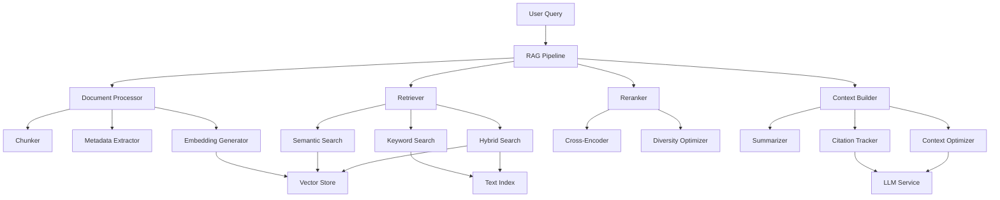

# RubberDuck Enhanced RAG System - Comprehensive Guide

## Table of Contents
1. [Introduction](#introduction)
2. [Architecture Overview](#architecture-overview)
3. [Core Components](#core-components)
4. [Document Processing Pipeline](#document-processing-pipeline)
5. [Vector Store Integration](#vector-store-integration)
6. [Retrieval Strategies](#retrieval-strategies)
7. [Document Reranking System](#document-reranking-system)
8. [Context Preparation](#context-preparation)
9. [Performance Optimization](#performance-optimization)
10. [Integration with LLM Service](#integration-with-llm-service)
11. [Usage Examples](#usage-examples)
12. [Best Practices](#best-practices)
13. [Monitoring and Metrics](#monitoring-and-metrics)
14. [Future Enhancements](#future-enhancements)

## Introduction

The Enhanced RAG (Retrieval Augmented Generation) system in RubberDuck is a sophisticated implementation that leverages Elixir's concurrent processing capabilities to provide efficient document retrieval and generation. This system goes beyond basic RAG implementations by incorporating advanced features like hybrid search, intelligent reranking, and parallel processing.

### Key Features
- **Concurrent Document Processing**: Leverages Elixir's Task.async_stream for parallel processing
- **Hybrid Search**: Combines semantic and keyword-based retrieval
- **Intelligent Reranking**: Cross-encoder based reranking with diversity optimization
- **Adaptive Context Building**: Dynamic context window optimization
- **Comprehensive Caching**: Multi-level caching for improved performance
- **Incremental Updates**: Efficient index updates without full rebuilds

## Architecture Overview



## Core Components

### 1. RAG Pipeline Module (`RubberDuck.RAG.Pipeline`)

The main orchestrator that coordinates all RAG operations:

```elixir
defmodule RubberDuck.RAG.Pipeline do
  use GenServer
  require Logger
  alias RubberDuck.RAG.{DocumentProcessor, Retriever, Reranker, ContextBuilder}
  alias RubberDuck.Telemetry
  
  @default_config [
    max_chunks: 20,
    chunk_size: 512,
    chunk_overlap: 50,
    retrieval_k: 10,
    rerank_k: 5,
    parallel_retrievals: 4
  ]
  
  # Client API
  def start_link(opts) do
    GenServer.start_link(__MODULE__, opts, name: __MODULE__)
  end
  
  def query(query, opts \\ []) do
    GenServer.call(__MODULE__, {:query, query, opts}, :infinity)
  end
  
  def index_documents(documents, opts \\ []) do
    GenServer.call(__MODULE__, {:index, documents, opts}, :infinity)
  end
  
  # Server Callbacks
  def init(opts) do
    config = Keyword.merge(@default_config, opts)
    {:ok, %{config: config, cache: %{}}}
  end
  
  def handle_call({:query, query, opts}, _from, state) do
    start_time = System.monotonic_time()
    
    result = with {:ok, processed_query} <- preprocess_query(query, opts),
                  {:ok, retrieved_docs} <- retrieve_documents(processed_query, state),
                  {:ok, reranked_docs} <- rerank_documents(retrieved_docs, query, state),
                  {:ok, context} <- build_context(reranked_docs, query, state) do
      {:ok, context}
    end
    
    Telemetry.execute([:rag, :query], %{duration: System.monotonic_time() - start_time}, %{query: query})
    
    {:reply, result, state}
  end
end
```

### 2. Document Processor (`RubberDuck.RAG.DocumentProcessor`)

Handles document chunking, metadata extraction, and embedding generation:

```elixir
defmodule RubberDuck.RAG.DocumentProcessor do
  alias RubberDuck.LLM.Service, as: LLMService
  
  @chunking_strategies %{
    fixed: &fixed_size_chunking/2,
    semantic: &semantic_chunking/2,
    sliding_window: &sliding_window_chunking/2
  }
  
  def process_documents(documents, opts \\ []) do
    strategy = Keyword.get(opts, :chunking_strategy, :sliding_window)
    chunk_size = Keyword.get(opts, :chunk_size, 512)
    chunk_overlap = Keyword.get(opts, :chunk_overlap, 50)
    
    documents
    |> Task.async_stream(&process_single_document(&1, strategy, chunk_size, chunk_overlap),
         max_concurrency: System.schedulers_online())
    |> Enum.reduce({:ok, []}, fn
      {:ok, {:ok, chunks}}, {:ok, acc} -> {:ok, acc ++ chunks}
      {:ok, {:error, reason}}, _ -> {:error, reason}
      {:exit, reason}, _ -> {:error, {:processing_failed, reason}}
    end)
  end
  
  defp process_single_document(document, strategy, chunk_size, chunk_overlap) do
    with {:ok, chunks} <- apply_chunking_strategy(document, strategy, chunk_size, chunk_overlap),
         {:ok, chunks_with_metadata} <- extract_metadata(chunks, document),
         {:ok, chunks_with_embeddings} <- generate_embeddings(chunks_with_metadata) do
      {:ok, chunks_with_embeddings}
    end
  end
  
  defp sliding_window_chunking(text, opts) do
    chunk_size = Keyword.get(opts, :chunk_size, 512)
    overlap = Keyword.get(opts, :chunk_overlap, 50)
    
    chunks = text
    |> String.graphemes()
    |> Enum.chunk_every(chunk_size, chunk_size - overlap, :discard)
    |> Enum.map(&Enum.join/1)
    
    {:ok, chunks}
  end
end
```

## Document Processing Pipeline

### Chunking Strategies

The system supports multiple chunking strategies:

1. **Fixed Size Chunking**: Simple character-based splitting
2. **Semantic Chunking**: Splits on sentence/paragraph boundaries
3. **Sliding Window**: Overlapping chunks for better context preservation

```elixir
defmodule RubberDuck.RAG.Chunker do
  @doc """
  Implements semantic chunking that respects natural language boundaries
  """
  def semantic_chunk(text, max_chunk_size) do
    sentences = split_into_sentences(text)
    
    sentences
    |> Enum.reduce({[], []}, fn sentence, {chunks, current_chunk} ->
      current_size = Enum.join(current_chunk, " ") |> String.length()
      sentence_size = String.length(sentence)
      
      cond do
        current_size + sentence_size > max_chunk_size && current_chunk != [] ->
          {[Enum.join(current_chunk, " ") | chunks], [sentence]}
        
        true ->
          {chunks, current_chunk ++ [sentence]}
      end
    end)
    |> finalize_chunks()
  end
  
  defp split_into_sentences(text) do
    # Advanced sentence splitting logic that handles abbreviations, etc.
    Regex.split(~r/(?<=[.!?])\s+(?=[A-Z])/, text)
  end
end
```

### Metadata Extraction

Extracts rich metadata from documents for better retrieval:

```elixir
defmodule RubberDuck.RAG.MetadataExtractor do
  def extract(chunk, document) do
    %{
      chunk_id: generate_chunk_id(chunk),
      document_id: document.id,
      source: document.source,
      language: detect_language(chunk),
      position: calculate_position(chunk, document),
      timestamp: DateTime.utc_now(),
      entities: extract_entities(chunk),
      keywords: extract_keywords(chunk),
      code_language: detect_code_language(chunk)
    }
  end
  
  defp extract_entities(text) do
    # Named entity recognition logic
    # Could integrate with external NER service
  end
  
  defp extract_keywords(text) do
    # TF-IDF or other keyword extraction
  end
end
```

## Vector Store Integration

### pgvector Implementation

The system uses PostgreSQL with pgvector extension for efficient similarity search:

```elixir
defmodule RubberDuck.RAG.VectorStore do
  use Ecto.Schema
  import Ecto.Query
  alias RubberDuck.Repo
  
  schema "document_chunks" do
    field :content, :string
    field :embedding, {:array, :float}
    field :metadata, :map
    field :document_id, :binary_id
    
    timestamps()
  end
  
  def similarity_search(query_embedding, opts \\ []) do
    limit = Keyword.get(opts, :limit, 10)
    threshold = Keyword.get(opts, :threshold, 0.7)
    
    from(c in __MODULE__,
      where: fragment("? <=> ? < ?", c.embedding, ^query_embedding, ^(1 - threshold)),
      order_by: fragment("? <=> ?", c.embedding, ^query_embedding),
      limit: ^limit
    )
    |> Repo.all()
  end
  
  def hybrid_search(query_embedding, query_text, opts \\ []) do
    semantic_weight = Keyword.get(opts, :semantic_weight, 0.7)
    keyword_weight = Keyword.get(opts, :keyword_weight, 0.3)
    
    from(c in __MODULE__,
      select: %{
        chunk: c,
        score: fragment(
          "? * (1 - (? <=> ?)) + ? * ts_rank(to_tsvector('english', ?), plainto_tsquery('english', ?))",
          ^semantic_weight,
          c.embedding,
          ^query_embedding,
          ^keyword_weight,
          c.content,
          ^query_text
        )
      },
      where: fragment("? <=> ? < ?", c.embedding, ^query_embedding, ^0.5) or
             fragment("to_tsvector('english', ?) @@ plainto_tsquery('english', ?)", c.content, ^query_text),
      order_by: [desc: 2],
      limit: ^Keyword.get(opts, :limit, 20)
    )
    |> Repo.all()
  end
end
```

### Index Optimization

Implements partitioned indexes for better performance:

```elixir
defmodule RubberDuck.RAG.IndexOptimizer do
  def create_partitioned_index(table_name, partition_key) do
    # Create partitioned indexes based on document source or date
    Ecto.Adapters.SQL.query!(
      Repo,
      """
      CREATE INDEX CONCURRENTLY idx_#{table_name}_embedding_#{partition_key}
      ON #{table_name} USING ivfflat (embedding vector_cosine_ops)
      WHERE #{partition_key} = $1
      """,
      [partition_key]
    )
  end
  
  def optimize_index_parameters do
    # Tune HNSW or IVFFlat parameters based on data characteristics
    %{
      m: 16,  # Number of connections
      ef_construction: 200,  # Size of dynamic candidate list
      ef_search: 50  # Size of dynamic candidate list for search
    }
  end
end
```

## Retrieval Strategies

### 1. Semantic Similarity Search

Pure vector-based retrieval:

```elixir
defmodule RubberDuck.RAG.Retriever.Semantic do
  alias RubberDuck.RAG.VectorStore
  alias RubberDuck.LLM.Service, as: LLMService
  
  def retrieve(query, opts \\ []) do
    with {:ok, query_embedding} <- generate_query_embedding(query),
         chunks <- VectorStore.similarity_search(query_embedding, opts) do
      {:ok, chunks}
    end
  end
  
  defp generate_query_embedding(query) do
    LLMService.generate_embedding(query, model: "text-embedding-3-small")
  end
end
```

### 2. Hybrid Search

Combines semantic and keyword search:

```elixir
defmodule RubberDuck.RAG.Retriever.Hybrid do
  alias RubberDuck.RAG.VectorStore
  
  def retrieve(query, opts \\ []) do
    with {:ok, query_embedding} <- generate_query_embedding(query),
         results <- VectorStore.hybrid_search(query_embedding, query, opts) do
      
      # Normalize and combine scores
      normalized_results = normalize_scores(results)
      {:ok, normalized_results}
    end
  end
  
  defp normalize_scores(results) do
    max_score = Enum.max_by(results, & &1.score).score
    min_score = Enum.min_by(results, & &1.score).score
    range = max_score - min_score
    
    Enum.map(results, fn result ->
      normalized_score = if range > 0 do
        (result.score - min_score) / range
      else
        1.0
      end
      
      Map.put(result.chunk, :normalized_score, normalized_score)
    end)
  end
end
```

### 3. Contextual Retrieval

Uses conversation history and user context:

```elixir
defmodule RubberDuck.RAG.Retriever.Contextual do
  alias RubberDuck.Memory.Manager, as: MemoryManager
  
  def retrieve(query, user_id, opts \\ []) do
    # Get user context from memory
    context = MemoryManager.get_context(user_id)
    
    # Expand query with context
    expanded_query = expand_query_with_context(query, context)
    
    # Use hybrid retrieval with expanded query
    RubberDuck.RAG.Retriever.Hybrid.retrieve(expanded_query, opts)
  end
  
  defp expand_query_with_context(query, context) do
    recent_topics = extract_recent_topics(context)
    user_preferences = context.preferences || %{}
    
    """
    #{query}
    
    Context: Working with #{Enum.join(recent_topics, ", ")}
    Preferences: #{format_preferences(user_preferences)}
    """
  end
end
```

## Document Reranking System

### Cross-Encoder Reranking

Uses a more sophisticated model to rerank retrieved documents:

```elixir
defmodule RubberDuck.RAG.Reranker do
  alias RubberDuck.LLM.Service, as: LLMService
  
  def rerank(documents, query, opts \\ []) do
    top_k = Keyword.get(opts, :top_k, 5)
    diversity_weight = Keyword.get(opts, :diversity_weight, 0.2)
    
    # Score each document with cross-encoder
    scored_docs = documents
    |> Task.async_stream(&score_document(&1, query), max_concurrency: 4)
    |> Enum.map(fn {:ok, scored_doc} -> scored_doc end)
    
    # Apply diversity optimization
    diverse_docs = apply_diversity_optimization(scored_docs, diversity_weight)
    
    # Return top K
    diverse_docs
    |> Enum.sort_by(& &1.final_score, :desc)
    |> Enum.take(top_k)
  end
  
  defp score_document(document, query) do
    prompt = """
    Rate the relevance of the following document to the query on a scale of 0-1:
    
    Query: #{query}
    
    Document: #{document.content}
    
    Provide only a numerical score.
    """
    
    case LLMService.complete(prompt, model: "gpt-4", temperature: 0) do
      {:ok, response} ->
        score = parse_score(response.content)
        Map.put(document, :relevance_score, score)
      
      {:error, _} ->
        Map.put(document, :relevance_score, 0.5)
    end
  end
  
  defp apply_diversity_optimization(documents, diversity_weight) do
    # MMR (Maximal Marginal Relevance) implementation
    selected = []
    remaining = documents
    
    Enum.reduce(1..length(documents), {selected, remaining}, fn _, {sel, rem} ->
      if rem == [] do
        {sel, rem}
      else
        best = Enum.max_by(rem, fn doc ->
          relevance = doc.relevance_score
          diversity = calculate_diversity(doc, sel)
          
          (1 - diversity_weight) * relevance + diversity_weight * diversity
        end)
        
        {sel ++ [best], List.delete(rem, best)}
      end
    end)
    |> elem(0)
    |> Enum.with_index()
    |> Enum.map(fn {doc, idx} ->
      Map.put(doc, :final_score, doc.relevance_score * :math.pow(0.95, idx))
    end)
  end
  
  defp calculate_diversity(document, selected_documents) do
    if selected_documents == [] do
      1.0
    else
      similarities = Enum.map(selected_documents, fn selected ->
        calculate_similarity(document.embedding, selected.embedding)
      end)
      
      1.0 - Enum.max(similarities)
    end
  end
end
```

## Context Preparation

### Document Summarization

Intelligently summarizes retrieved documents:

```elixir
defmodule RubberDuck.RAG.ContextBuilder.Summarizer do
  alias RubberDuck.LLM.Service, as: LLMService
  
  def summarize_for_context(documents, query, max_tokens) do
    # Group similar documents
    grouped_docs = group_similar_documents(documents)
    
    # Summarize each group
    summaries = grouped_docs
    |> Task.async_stream(&summarize_group(&1, query), max_concurrency: 3)
    |> Enum.map(fn {:ok, summary} -> summary end)
    
    # Fit within token limit
    fit_summaries_to_limit(summaries, max_tokens)
  end
  
  defp summarize_group(documents, query) do
    combined_content = documents
    |> Enum.map(& &1.content)
    |> Enum.join("\n\n---\n\n")
    
    prompt = """
    Summarize the following documents in the context of this query: #{query}
    
    Focus on information relevant to answering the query.
    
    Documents:
    #{combined_content}
    
    Provide a concise summary:
    """
    
    case LLMService.complete(prompt, model: "gpt-4", max_tokens: 200) do
      {:ok, response} -> 
        %{
          summary: response.content,
          source_documents: documents,
          relevance_score: calculate_group_relevance(documents)
        }
      
      {:error, _} -> 
        %{
          summary: truncate_content(combined_content, 200),
          source_documents: documents,
          relevance_score: 0.5
        }
    end
  end
end
```

### Context Window Optimization

Dynamically optimizes context to fit within token limits:

```elixir
defmodule RubberDuck.RAG.ContextBuilder.Optimizer do
  @max_context_tokens 3000
  @query_tokens_estimate 100
  @response_tokens_reserve 1000
  
  def optimize_context(documents, query, model_config) do
    available_tokens = calculate_available_tokens(model_config)
    
    # Sort by relevance
    sorted_docs = Enum.sort_by(documents, & &1.final_score, :desc)
    
    # Greedy selection within token budget
    {selected, _} = Enum.reduce(sorted_docs, {[], available_tokens}, fn doc, {selected, remaining} ->
      doc_tokens = estimate_tokens(doc.content)
      
      if doc_tokens <= remaining do
        {[doc | selected], remaining - doc_tokens}
      else
        {selected, remaining}
      end
    end)
    
    Enum.reverse(selected)
  end
  
  defp calculate_available_tokens(model_config) do
    model_max_tokens = model_config[:max_tokens] || 4096
    model_max_tokens - @query_tokens_estimate - @response_tokens_reserve
  end
  
  defp estimate_tokens(text) do
    # Simple estimation: ~4 characters per token
    div(String.length(text), 4)
  end
end
```

### Citation Tracking

Maintains references to source documents:

```elixir
defmodule RubberDuck.RAG.ContextBuilder.CitationTracker do
  def build_context_with_citations(documents) do
    {context_parts, citations} = documents
    |> Enum.with_index(1)
    |> Enum.map(fn {doc, idx} ->
      citation_marker = "[#{idx}]"
      
      context_part = """
      #{citation_marker} #{doc.content}
      """
      
      citation = %{
        id: idx,
        source: doc.metadata.source,
        chunk_id: doc.metadata.chunk_id,
        relevance_score: doc.final_score
      }
      
      {context_part, citation}
    end)
    |> Enum.unzip()
    
    %{
      context: Enum.join(context_parts, "\n\n"),
      citations: citations
    }
  end
end
```

## Performance Optimization

### Parallel Retrieval

Leverages Task.async_stream for concurrent operations:

```elixir
defmodule RubberDuck.RAG.ParallelRetriever do
  def retrieve_parallel(queries, opts \\ []) do
    max_concurrency = Keyword.get(opts, :max_concurrency, System.schedulers_online())
    
    queries
    |> Task.async_stream(
      fn query ->
        Retriever.retrieve(query, opts)
      end,
      max_concurrency: max_concurrency,
      timeout: 30_000
    )
    |> Enum.reduce({:ok, []}, fn
      {:ok, {:ok, results}}, {:ok, acc} -> 
        {:ok, merge_results(acc, results)}
      
      {:ok, {:error, reason}}, _ -> 
        {:error, reason}
      
      {:exit, :timeout}, _ -> 
        {:error, :retrieval_timeout}
    end)
  end
  
  defp merge_results(existing, new) do
    # Merge and deduplicate results
    (existing ++ new)
    |> Enum.uniq_by(& &1.chunk_id)
    |> Enum.sort_by(& &1.score, :desc)
  end
end
```

### Caching Layer

Multi-level caching for improved performance:

```elixir
defmodule RubberDuck.RAG.Cache do
  use GenServer
  
  @ets_table :rag_cache
  @ttl_seconds 3600  # 1 hour
  
  def start_link(_opts) do
    GenServer.start_link(__MODULE__, [], name: __MODULE__)
  end
  
  def init(_) do
    :ets.new(@ets_table, [:set, :public, :named_table, {:read_concurrency, true}])
    schedule_cleanup()
    {:ok, %{}}
  end
  
  def get(key) do
    case :ets.lookup(@ets_table, key) do
      [{^key, value, expiry}] ->
        if DateTime.compare(DateTime.utc_now(), expiry) == :lt do
          {:ok, value}
        else
          :ets.delete(@ets_table, key)
          :miss
        end
      
      [] ->
        :miss
    end
  end
  
  def put(key, value, ttl_seconds \\ @ttl_seconds) do
    expiry = DateTime.add(DateTime.utc_now(), ttl_seconds, :second)
    :ets.insert(@ets_table, {key, value, expiry})
    :ok
  end
  
  defp schedule_cleanup do
    Process.send_after(self(), :cleanup, 60_000)  # Every minute
  end
  
  def handle_info(:cleanup, state) do
    now = DateTime.utc_now()
    
    :ets.select_delete(@ets_table, [
      {
        {:"$1", :"$2", :"$3"},
        [{:<, :"$3", now}],
        [true]
      }
    ])
    
    schedule_cleanup()
    {:noreply, state}
  end
end
```

### Incremental Index Updates

Efficiently updates the index without full rebuilds:

```elixir
defmodule RubberDuck.RAG.IndexUpdater do
  alias RubberDuck.RAG.{DocumentProcessor, VectorStore}
  
  def update_incremental(changed_documents) do
    # Group by operation type
    grouped = Enum.group_by(changed_documents, & &1.operation)
    
    # Process each operation type
    with :ok <- process_deletions(grouped[:delete] || []),
         :ok <- process_updates(grouped[:update] || []),
         :ok <- process_additions(grouped[:add] || []) do
      :ok
    end
  end
  
  defp process_deletions(documents) do
    document_ids = Enum.map(documents, & &1.id)
    VectorStore.delete_by_document_ids(document_ids)
  end
  
  defp process_updates(documents) do
    # Delete old chunks
    process_deletions(documents)
    
    # Add new chunks
    process_additions(documents)
  end
  
  defp process_additions(documents) do
    # Process in batches for efficiency
    documents
    |> Enum.chunk_every(10)
    |> Enum.each(fn batch ->
      {:ok, chunks} = DocumentProcessor.process_documents(batch)
      VectorStore.insert_chunks(chunks)
    end)
    
    :ok
  end
end
```

## Integration with LLM Service

### RAG-Enhanced Generation

Integrates with the LLM service for context-aware generation:

```elixir
defmodule RubberDuck.RAG.Generator do
  alias RubberDuck.RAG.Pipeline
  alias RubberDuck.LLM.Service, as: LLMService
  alias RubberDuck.Context.Builder
  
  def generate_with_rag(query, opts \\ []) do
    with {:ok, rag_context} <- Pipeline.query(query, opts),
         {:ok, full_context} <- Builder.build_context(:rag, rag_context, query),
         {:ok, response} <- LLMService.complete_with_context(query, full_context) do
      
      {:ok, %{
        response: response.content,
        citations: rag_context.citations,
        confidence: calculate_confidence(rag_context, response)
      }}
    end
  end
  
  defp calculate_confidence(rag_context, response) do
    # Calculate confidence based on:
    # - Relevance scores of retrieved documents
    # - Coverage of query topics
    # - LLM's self-reported confidence
    
    avg_relevance = Enum.sum(Enum.map(rag_context.documents, & &1.final_score)) / length(rag_context.documents)
    
    confidence = avg_relevance * 0.6 + 
                 calculate_topic_coverage(rag_context, response) * 0.3 +
                 extract_llm_confidence(response) * 0.1
    
    Float.round(confidence, 2)
  end
end
```

## Usage Examples

### Basic RAG Query

```elixir
# Simple query
{:ok, result} = RubberDuck.RAG.Pipeline.query("How do I implement GenServer in Elixir?")

IO.inspect(result.context)
# => "Context with relevant code examples and documentation..."

IO.inspect(result.citations)
# => [%{id: 1, source: "genserver_guide.md", relevance_score: 0.92}, ...]
```

### Advanced Query with Options

```elixir
# Query with custom options
opts = [
  retrieval_k: 20,         # Retrieve more candidates
  rerank_k: 5,            # But only keep top 5 after reranking
  chunking_strategy: :semantic,
  max_context_tokens: 2000,
  include_code_examples: true
]

{:ok, result} = RubberDuck.RAG.Pipeline.query(
  "Show me examples of using Task.async_stream for parallel processing",
  opts
)
```

### Indexing New Documents

```elixir
# Index a new document
document = %{
  id: Ecto.UUID.generate(),
  source: "advanced_elixir_patterns.md",
  content: File.read!("docs/advanced_elixir_patterns.md"),
  metadata: %{
    type: "tutorial",
    language: "elixir",
    difficulty: "advanced"
  }
}

{:ok, indexed} = RubberDuck.RAG.Pipeline.index_documents([document])
```

### Incremental Updates

```elixir
# Update existing documents
changes = [
  %{id: "doc1", operation: :update, content: "Updated content..."},
  %{id: "doc2", operation: :delete},
  %{id: "doc3", operation: :add, content: "New document content..."}
]

:ok = RubberDuck.RAG.IndexUpdater.update_incremental(changes)
```

## Best Practices

### 1. Document Preparation
- **Clean and structure documents** before indexing
- **Add rich metadata** for better retrieval
- **Use appropriate chunk sizes** (typically 256-512 tokens)
- **Ensure chunk overlap** to preserve context

### 2. Query Optimization
- **Expand queries** with synonyms and related terms
- **Use query rewriting** for better semantic matching
- **Leverage user context** for personalized retrieval

### 3. Performance Tuning
- **Batch document processing** for large collections
- **Use appropriate concurrency levels** based on resources
- **Implement caching** at multiple levels
- **Monitor and optimize index performance**

### 4. Quality Assurance
- **Regularly evaluate retrieval quality** with test queries
- **Monitor reranking effectiveness**
- **Track citation accuracy**
- **A/B test different strategies**

## Monitoring and Metrics

### Key Metrics to Track

```elixir
defmodule RubberDuck.RAG.Metrics do
  use GenServer
  alias RubberDuck.Telemetry
  
  def init(_) do
    # Attach telemetry handlers
    :telemetry.attach_many(
      "rag-metrics",
      [
        [:rag, :query],
        [:rag, :retrieval],
        [:rag, :reranking],
        [:rag, :indexing]
      ],
      &handle_event/4,
      nil
    )
    
    {:ok, %{}}
  end
  
  def handle_event([:rag, :query], measurements, metadata, _) do
    # Track query latency
    Logger.info("RAG query completed in #{measurements.duration}ms")
    
    # Track query patterns
    track_query_pattern(metadata.query)
  end
  
  def handle_event([:rag, :retrieval], measurements, metadata, _) do
    # Track retrieval precision/recall
    track_retrieval_quality(measurements, metadata)
  end
end
```

### Performance Dashboard

Monitor these key indicators:
- **Query latency** (p50, p95, p99)
- **Retrieval precision and recall**
- **Reranking effectiveness** (NDCG scores)
- **Cache hit rates**
- **Index size and query performance**
- **Document processing throughput**

## Future Enhancements

### 1. Advanced Retrieval Methods
- **Query expansion** using LLM-generated alternatives
- **Multi-hop retrieval** for complex queries
- **Temporal-aware retrieval** for time-sensitive content

### 2. Improved Reranking
- **Fine-tuned cross-encoder models**
- **Learning-to-rank with user feedback**
- **Personalized reranking** based on user history

### 3. Scalability Improvements
- **Distributed vector store** with sharding
- **GPU acceleration** for embeddings
- **Streaming indexing** for real-time updates

### 4. Quality Enhancements
- **Automatic chunk size optimization**
- **Dynamic retrieval strategy selection**
- **Hallucination detection** in generated content

## Conclusion

The Enhanced RAG system in RubberDuck represents a sophisticated implementation that goes beyond basic retrieval-augmented generation. By leveraging Elixir's concurrent processing capabilities, implementing advanced retrieval and reranking strategies, and providing comprehensive caching and optimization features, the system delivers high-quality, context-aware responses while maintaining excellent performance.

The modular architecture ensures that each component can be independently improved and optimized, while the comprehensive monitoring and metrics system provides the visibility needed to maintain and enhance the system over time.
