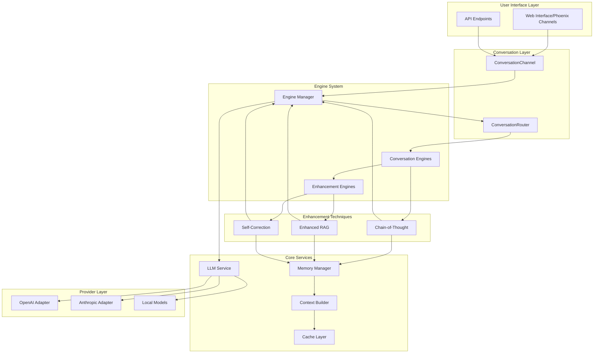

# RubberDuck LLM Integration Enhancement System: Comprehensive Guide

## Table of Contents

1. [Introduction](#introduction)
2. [System Architecture Overview](#system-architecture-overview)
3. [Core Components](#core-components)
   - [LLM Service Architecture](#llm-service-architecture)
   - [Provider Adapters](#provider-adapters)
   - [Hierarchical Memory System](#hierarchical-memory-system)
   - [Context Building and Caching](#context-building-and-caching)
4. [Enhancement Techniques](#enhancement-techniques)
   - [Chain-of-Thought (CoT)](#chain-of-thought-cot)
   - [Enhanced RAG Implementation](#enhanced-rag-implementation)
   - [Iterative Self-Correction](#iterative-self-correction)
5. [Enhancement Integration and Coordination](#enhancement-integration-and-coordination)
6. [Usage Examples](#usage-examples)
7. [Configuration Guide](#configuration-guide)
8. [Performance Optimization](#performance-optimization)
9. [Monitoring and Debugging](#monitoring-and-debugging)
10. [Best Practices](#best-practices)

## Introduction

The RubberDuck LLM Integration Enhancement System represents a sophisticated, multi-layered approach to integrating Large Language Models into a coding assistant. Built on Elixir's concurrent, fault-tolerant architecture, this system combines multiple state-of-the-art AI techniques to deliver superior code generation, analysis, and assistance capabilities.

### Key Features

- **Multi-Provider Support**: Seamless integration with OpenAI, Anthropic, and local models
- **Intelligent Fallback**: Automatic provider switching on failures
- **Advanced Enhancement Techniques**: CoT, RAG, and Self-Correction working in harmony
- **Hierarchical Memory**: Three-tier memory system for context persistence
- **Concurrent Processing**: Leverages Elixir's actor model for parallel operations
- **Fault Tolerance**: Built on OTP principles with circuit breakers and supervision trees

## System Architecture Overview



## Core Components

### LLM Service Architecture

The LLM Service (`RubberDuck.LLM.Service`) is a GenServer that manages all interactions with LLM providers. It implements:

#### Key Features

1. **Provider Management**
   ```elixir
   # Configuration structure
   config :rubber_duck, :llm_providers, [
     %{
       name: :openai,
       module: RubberDuck.LLM.Providers.OpenAI,
       api_key: System.get_env("OPENAI_API_KEY"),
       models: ["gpt-4", "gpt-4-turbo-preview"],
       rate_limit: 60,  # requests per minute
       priority: 1
     },
     %{
       name: :anthropic,
       module: RubberDuck.LLM.Providers.Anthropic,
       api_key: System.get_env("ANTHROPIC_API_KEY"),
       models: ["claude-3-opus", "claude-3-sonnet"],
       rate_limit: 50,
       priority: 2
     }
   ]
   ```

2. **Circuit Breaker Pattern**
   - Prevents cascading failures
   - Automatic recovery with exponential backoff
   - Health monitoring per provider

3. **Rate Limiting**
   - Token bucket algorithm
   - Per-provider limits
   - Request queuing with priorities

4. **Cost Tracking**
   - Token usage monitoring
   - Cost calculation per provider
   - Budget alerts

#### Usage Example

```elixir
# Direct usage
{:ok, response} = RubberDuck.LLM.Service.complete(%{
  model: "gpt-4",
  messages: [
    %{role: "system", content: "You are a helpful coding assistant"},
    %{role: "user", content: "Write a function to calculate fibonacci"}
  ],
  temperature: 0.7,
  max_tokens: 500
})

# With streaming
RubberDuck.LLM.Service.stream_complete(%{
  model: "claude-3-opus",
  messages: messages,
  on_chunk: fn chunk ->
    IO.write(chunk.content)
  end
})
```

### Provider Adapters

Provider adapters normalize different LLM APIs into a unified interface:

#### Unified Response Format

```elixir
%RubberDuck.LLM.Response{
  content: "Generated text...",
  model: "gpt-4",
  usage: %{
    prompt_tokens: 150,
    completion_tokens: 350,
    total_tokens: 500
  },
  metadata: %{
    provider: :openai,
    request_id: "req_123",
    latency_ms: 1234
  }
}
```

#### Provider-Specific Features

1. **OpenAI Adapter**
   - Function calling support
   - JSON mode
   - Vision capabilities
   - Streaming with Server-Sent Events

2. **Anthropic Adapter**
   - System prompts
   - Long context windows (200k tokens)
   - Constitutional AI alignment
   - Streaming with chunked responses

3. **Mock Provider**
   - Testing and development
   - Predictable responses
   - Latency simulation
   - Error injection

### Hierarchical Memory System

The memory system (`RubberDuck.Memory.Manager`) implements a three-tier architecture:

#### Memory Tiers

1. **Short-term Memory (Session-based)**
   - Stored in ETS with FIFO eviction
   - Last 20 interactions
   - Immediate context for current task
   - Sub-millisecond access

2. **Mid-term Memory (Pattern Extraction)**
   - Heat score based relevance
   - Session summarization
   - Pattern recognition
   - Cached for hours/days

3. **Long-term Memory (Persistent Storage)**
   - PostgreSQL with pgvector
   - User preferences (UserProfile)
   - Code patterns (CodePattern)
   - Semantic similarity search

#### Memory Operations

```elixir
# Store interaction
Memory.Manager.store_interaction(%{
  session_id: session_id,
  type: :code_generation,
  input: "Create a GenServer for user authentication",
  output: generated_code,
  metadata: %{language: "elixir", project_id: project_id}
})

# Retrieve relevant context
context = Memory.Manager.get_relevant_context(%{
  session_id: session_id,
  query: "authentication patterns",
  limit: 5,
  include_tiers: [:short, :mid, :long]
})

# Update user preferences
Memory.Manager.update_user_preference(%{
  user_id: user_id,
  preference_type: :code_style,
  value: %{
    naming_convention: :snake_case,
    max_line_length: 80,
    documentation_style: :ex_doc
  }
})
```

### Context Building and Caching

The Context Builder (`RubberDuck.Context.Builder`) creates optimized contexts for LLM prompts:

#### Context Strategies

1. **FIM (Fill-in-the-Middle)**
   ```elixir
   context = Context.Builder.build(:fim, %{
     prefix: "defmodule UserAuth do\n  def authenticate(user, password) do\n    ",
     suffix: "\n  end\nend",
     max_tokens: 1000
   })
   ```

2. **RAG (Retrieval Augmented Generation)**
   ```elixir
   context = Context.Builder.build(:rag, %{
     query: "implement JWT token generation",
     project_id: project_id,
     include_files: true,
     include_patterns: true,
     max_context_size: 4000
   })
   ```

3. **Long Context Window**
   ```elixir
   context = Context.Builder.build(:long_context, %{
     files: [file1, file2, file3],
     focus_area: :authentication,
     compression_level: :medium
   })
   ```

#### Caching System

- ETS-based cache with TTL
- Cache key generation based on context parameters
- Automatic invalidation on file changes
- Hit rate monitoring

## Enhancement Techniques

### Chain-of-Thought (CoT)

The CoT implementation uses Spark DSL for declarative configuration:

#### DSL Configuration

```elixir
defmodule MyProject.CoTEngine do
  use RubberDuck.CoT.Dsl

  reasoning_chain do
    step :understand_requirements do
      prompt_template "First, let me understand what you're asking for: {{input}}"
      validation :has_clear_objective
    end
    
    step :analyze_approach do
      prompt_template "Now I'll analyze different approaches to solve this..."
      depends_on :understand_requirements
    end
    
    step :implement_solution do
      prompt_template "Based on my analysis, here's the implementation..."
      depends_on :analyze_approach
      validation :syntax_valid
    end
    
    step :verify_correctness do
      prompt_template "Let me verify this solution is correct..."
      depends_on :implement_solution
    end
  end
  
  templates do
    template :default, """
    You are a thoughtful coding assistant. Work through problems step by step.
    Show your reasoning clearly.
    """
    
    template :debugging, """
    You are debugging code. Think through potential issues systematically.
    Consider edge cases and common pitfalls.
    """
  end
end
```

#### Execution Flow

```elixir
# Start a CoT session
{:ok, session_id} = CoT.ConversationManager.start_session(%{
  engine: MyProject.CoTEngine,
  template: :default,
  context: initial_context
})

# Execute reasoning chain
{:ok, result} = CoT.ConversationManager.execute(session_id, %{
  input: "Create a rate limiter using GenServer",
  options: %{
    max_iterations: 3,
    consistency_threshold: 0.8
  }
})

# Access intermediate steps
steps = CoT.ConversationManager.get_chain_history(session_id)
```

### Enhanced RAG Implementation

The RAG system provides sophisticated document retrieval and context augmentation:

#### Document Processing Pipeline

```elixir
# Process documents for RAG
{:ok, doc_id} = RAG.Pipeline.process_document(%{
  content: file_content,
  metadata: %{
    file_path: "/lib/auth/user.ex",
    language: "elixir",
    project_id: project_id
  },
  chunking_strategy: :semantic,
  chunk_size: 500,
  chunk_overlap: 50
})

# Parallel processing for multiple documents
doc_ids = RAG.Pipeline.process_documents_parallel(documents, %{
  max_concurrency: 10,
  chunk_size: 500
})
```

#### Retrieval Strategies

1. **Semantic Search**
   ```elixir
   results = RAG.Pipeline.retrieve(:semantic, %{
     query: "authentication middleware",
     limit: 10,
     similarity_threshold: 0.7
   })
   ```

2. **Hybrid Search**
   ```elixir
   results = RAG.Pipeline.retrieve(:hybrid, %{
     query: "JWT token validation",
     semantic_weight: 0.7,
     keyword_weight: 0.3,
     limit: 15
   })
   ```

3. **Contextual Retrieval**
   ```elixir
   results = RAG.Pipeline.retrieve(:contextual, %{
     query: "implement OAuth2",
     context: current_file_content,
     expand_context: true,
     limit: 20
   })
   ```

#### Reranking System

```elixir
# Rerank retrieved documents
reranked = RAG.Pipeline.rerank(results, %{
  strategy: :cross_encoder,
  diversity_factor: 0.3,
  relevance_threshold: 0.8
})

# Prepare augmented context
augmented_context = RAG.Pipeline.prepare_context(reranked, %{
  summarize: true,
  max_length: 3000,
  include_citations: true
})
```

### Iterative Self-Correction

The Self-Correction engine continuously improves outputs:

#### Correction Strategies

```elixir
defmodule MyProject.CodeValidator do
  use RubberDuck.SelfCorrection.Strategy
  
  @impl true
  def evaluate(output, context) do
    %{
      syntax_valid: check_syntax(output),
      semantic_issues: find_semantic_issues(output),
      improvements: suggest_improvements(output, context),
      score: calculate_quality_score(output)
    }
  end
  
  @impl true
  def apply_corrections(output, issues) do
    output
    |> fix_syntax_errors(issues.syntax_errors)
    |> improve_semantics(issues.semantic_issues)
    |> apply_suggestions(issues.improvements)
  end
end
```

#### Iteration Control

```elixir
# Execute self-correction loop
{:ok, corrected} = SelfCorrection.Engine.correct(%{
  input: initial_output,
  strategies: [:syntax, :semantics, :logic],
  max_iterations: 5,
  convergence_threshold: 0.95,
  early_stop: true
})

# Track correction history
history = SelfCorrection.Engine.get_correction_history(corrected.id)
```

## Enhancement Integration and Coordination

Enhancement techniques are now integrated through the conversation engine system:

### Engine-Based Enhancement

```elixir
# Conversation engines automatically select enhancement techniques
{:ok, result} = EngineManager.execute(:conversation_router, %{
  query: "Create a distributed rate limiter",
  context: %{project_id: project_id}
})

# Complex queries automatically use CoT through ComplexConversation engine
{:ok, result} = EngineManager.execute(:complex_conversation, %{
  query: "Design a fault-tolerant system",
  context: %{requirements: requirements}
})

# Analysis uses specialized enhancement
{:ok, result} = EngineManager.execute(:analysis_conversation, %{
  query: "Review this code for performance",
  code: code_content,
  context: %{analysis_type: :performance}
})
```

### Direct Enhancement Usage

```elixir
# Use specific engines for enhancement
# RAG enhancement through generation engine
{:ok, result} = EngineManager.execute(:generation, %{
  prompt: "Generate based on patterns",
  context: %{similar_code: retrieved_examples}
})

# Self-correction through problem solver
{:ok, result} = EngineManager.execute(:problem_solver, %{
  query: "Fix this implementation",
  error_details: %{code: buggy_code, error: error_msg}
})
```

### Enhancement Configuration

```elixir
# Configure engines with enhancement preferences
config :rubber_duck, :engines,
  complex_conversation: [
    use_cot: true,
    cot_chain: ConversationChain,
    max_reasoning_steps: 10
  ],
  generation_conversation: [
    use_rag: true,
    retrieval_strategy: :hybrid,
    self_correct: true
  ]
```

### A/B Testing Framework

```elixir
# Set up A/B test
{:ok, test_id} = Enhancement.Coordinator.create_ab_test(%{
  name: "cot_vs_rag_performance",
  variants: [
    %{name: :cot_only, pipeline: [:cot]},
    %{name: :rag_only, pipeline: [:rag]},
    %{name: :combined, pipeline: [:cot, :rag]}
  ],
  metrics: [:quality_score, :latency, :user_satisfaction],
  duration: {7, :days}
})

# Execute with A/B testing
{:ok, result} = Enhancement.Coordinator.enhance_with_ab_test(test_id, %{
  input: query,
  user_id: user_id
})

# Get test results
{:ok, analysis} = Enhancement.Coordinator.analyze_ab_test(test_id)
```

## Usage Examples

### Example 1: Simple Code Completion

```elixir
defmodule MyApp.CodeAssistant do
  alias RubberDuck.Engine.Manager, as: EngineManager
  
  def complete_code(prefix, suffix, options \\ %{}) do
    # Build input for completion engine
    input = %{
      prefix: prefix,
      suffix: suffix,
      language: options[:language] || "elixir",
      max_suggestions: options[:max_suggestions] || 3
    }
    
    # Completion engine handles RAG enhancement internally
    EngineManager.execute(:completion, input, 30_000)
  end
end
```

### Example 2: Complex Code Generation with Full Enhancement

```elixir
defmodule MyApp.CodeGenerator do
  alias RubberDuck.Engine.Manager, as: EngineManager
  alias RubberDuck.Memory.Manager, as: MemoryManager
  
  def generate_complex_code(description, project_id) do
    # Store the request in memory
    MemoryManager.store_interaction(%{
      type: :generation_request,
      input: description,
      project_id: project_id
    })
    
    # Use generation conversation engine with full enhancements
    input = %{
      query: description,
      context: %{
        project_id: project_id,
        requirements: parse_requirements(description),
        existing_patterns: get_project_patterns(project_id)
      },
      options: %{
        include_tests: true,
        include_docs: true
      }
    }
    
    # GenerationConversation engine handles CoT, RAG, and self-correction
    case EngineManager.execute(:generation_conversation, input, 60_000) do
      {:ok, result} ->
        # Store successful result
        MemoryManager.store_interaction(%{
          type: :generation_result,
          output: result.generated_code,
          project_id: project_id,
          quality_score: calculate_quality_score(result)
        })
        
        {:ok, result}
        
      {:error, reason} ->
        Logger.error("Code generation failed: #{inspect(reason)}")
        {:error, reason}
    end
  end
  
  defp parse_requirements(description) do
    # Extract requirements from natural language description
    %{
      features: extract_features(description),
      constraints: extract_constraints(description),
      technology: detect_technology_stack(description)
    }
  end
end
```

### Example 3: Interactive Debugging Session

```elixir
defmodule MyApp.Debugger do
  alias RubberDuck.{CoT, Memory, SelfCorrection}
  
  def start_debug_session(code, error_message) do
    # Start CoT conversation for debugging
    {:ok, session_id} = CoT.ConversationManager.start_session(%{
      template: :debugging,
      context: %{
        code: code,
        error: error_message
      }
    })
    
    # Execute debugging chain
    {:ok, analysis} = CoT.ConversationManager.execute(session_id, %{
      input: "Debug this code error: #{error_message}",
      options: %{
        include_memory: true,
        search_similar_errors: true
      }
    })
    
    # Apply self-correction to suggested fixes
    {:ok, verified_fix} = SelfCorrection.Engine.correct(%{
      input: analysis.suggested_fix,
      strategies: [:syntax, :logic],
      context: %{original_code: code}
    })
    
    %{
      session_id: session_id,
      analysis: analysis,
      verified_fix: verified_fix,
      confidence: calculate_confidence(analysis, verified_fix)
    }
  end
end
```

## Configuration Guide

### Environment Variables

```bash
# LLM Provider Keys
export OPENAI_API_KEY="sk-..."
export ANTHROPIC_API_KEY="sk-ant-..."

# Memory Configuration
export MEMORY_SHORT_TERM_SIZE="100"
export MEMORY_MID_TERM_TTL="3600"
export MEMORY_LONG_TERM_POOL_SIZE="10"

# Enhancement Settings
export COT_MAX_STEPS="10"
export RAG_CHUNK_SIZE="500"
export SELF_CORRECTION_MAX_ITERATIONS="5"

# Performance Tuning
export LLM_REQUEST_TIMEOUT="30000"
export CONTEXT_CACHE_TTL="1800"
export ENHANCEMENT_MAX_CONCURRENCY="20"
```

### Application Configuration

```elixir
# config/config.exs
config :rubber_duck, :enhancement,
  # Enhancement Coordinator settings
  default_pipeline: [:rag],
  complexity_threshold: 0.7,
  ab_testing_enabled: true,
  
  # CoT settings
  cot: [
    max_chain_length: 10,
    default_template: :general,
    consistency_check: true,
    cache_results: true
  ],
  
  # RAG settings
  rag: [
    embedding_model: "text-embedding-ada-002",
    chunk_size: 500,
    chunk_overlap: 50,
    retrieval_limit: 20,
    rerank_enabled: true,
    similarity_threshold: 0.7
  ],
  
  # Self-Correction settings
  self_correction: [
    max_iterations: 5,
    convergence_threshold: 0.95,
    early_stop: true,
    strategies: [:syntax, :logic, :semantics]
  ]

# Memory configuration
config :rubber_duck, :memory,
  short_term: [
    backend: :ets,
    max_size: 100,
    eviction: :fifo
  ],
  mid_term: [
    backend: :ets,
    ttl_seconds: 3600,
    pattern_threshold: 3
  ],
  long_term: [
    backend: :postgres,
    pool_size: 10,
    vector_dimensions: 1536
  ]
```

## Performance Optimization

### Concurrent Processing

```elixir
defmodule RubberDuck.Performance do
  def optimize_rag_retrieval(queries) do
    # Parallel retrieval
    Task.async_stream(queries, 
      fn query ->
        RAG.Pipeline.retrieve(:semantic, query)
      end,
      max_concurrency: System.schedulers_online() * 2,
      timeout: 5000
    )
    |> Enum.map(fn {:ok, result} -> result end)
  end
  
  def batch_llm_requests(requests) do
    # Group by model for efficient batching
    requests
    |> Enum.group_by(& &1.model)
    |> Enum.map(fn {model, batch} ->
      Task.async(fn ->
        LLM.Service.batch_complete(model, batch)
      end)
    end)
    |> Task.await_many(30_000)
  end
end
```

### Caching Strategies

```elixir
# Context caching
defmodule RubberDuck.Cache.Strategy do
  def cache_key(params) do
    params
    |> Map.take([:query, :project_id, :strategy])
    |> :erlang.phash2()
    |> Integer.to_string()
  end
  
  def with_cache(key, ttl, fun) do
    case Cache.get(key) do
      {:ok, value} -> 
        Telemetry.execute([:cache, :hit], %{count: 1})
        value
      
      :not_found ->
        value = fun.()
        Cache.put(key, value, ttl: ttl)
        Telemetry.execute([:cache, :miss], %{count: 1})
        value
    end
  end
end
```

### Resource Management

```elixir
# Connection pooling for LLM providers
config :rubber_duck, :llm_pools,
  openai: [
    size: 10,
    max_overflow: 5,
    strategy: :fifo
  ],
  anthropic: [
    size: 8,
    max_overflow: 3,
    strategy: :lifo
  ]

# Memory pool configuration
config :rubber_duck, RubberDuck.Memory.Repo,
  pool_size: 20,
  queue_target: 5000,
  queue_interval: 1000
```

## Monitoring and Debugging

### Telemetry Events

```elixir
# Available telemetry events
[
  # LLM events
  [:rubber_duck, :llm, :request, :start],
  [:rubber_duck, :llm, :request, :stop],
  [:rubber_duck, :llm, :request, :exception],
  
  # Enhancement events
  [:rubber_duck, :enhancement, :pipeline, :start],
  [:rubber_duck, :enhancement, :technique, :start],
  [:rubber_duck, :enhancement, :technique, :stop],
  
  # Memory events
  [:rubber_duck, :memory, :store],
  [:rubber_duck, :memory, :retrieve],
  [:rubber_duck, :memory, :consolidate],
  
  # Cache events
  [:rubber_duck, :cache, :hit],
  [:rubber_duck, :cache, :miss],
  [:rubber_duck, :cache, :evict]
]

# Attach handlers
:telemetry.attach_many(
  "rubber-duck-metrics",
  [
    [:rubber_duck, :llm, :request, :stop],
    [:rubber_duck, :enhancement, :pipeline, :stop]
  ],
  &RubberDuck.Metrics.handle_event/4,
  nil
)
```

### Debug Mode

```elixir
# Enable debug mode for detailed logging
config :rubber_duck, :debug,
  log_llm_requests: true,
  log_llm_responses: true,
  trace_enhancement_pipeline: true,
  memory_operations: true,
  cache_operations: false

# Debug helper functions
defmodule RubberDuck.Debug do
  def trace_enhancement(input, opts \\ []) do
    Logger.metadata(trace_id: UUID.uuid4())
    
    opts = Keyword.put(opts, :trace, true)
    result = Enhancement.Coordinator.enhance(:sequential, input, opts)
    
    trace = Enhancement.Coordinator.get_trace(result.trace_id)
    IO.inspect(trace, label: "Enhancement Trace")
    
    result
  end
  
  def inspect_memory(session_id) do
    %{
      short_term: Memory.Manager.get_short_term(session_id),
      mid_term: Memory.Manager.get_mid_term(session_id),
      patterns: Memory.Manager.get_patterns(session_id)
    }
  end
end
```

## Best Practices

### 1. Provider Selection

```elixir
# Configure providers based on use case
def select_provider(task_type) do
  case task_type do
    :code_generation -> :openai  # GPT-4 for complex generation
    :conversation -> :anthropic   # Claude for natural dialogue
    :quick_completion -> :local   # Local model for speed
    _ -> :openai                  # Default fallback
  end
end
```

### 2. Memory Management

```elixir
# Implement memory cleanup for long sessions
defmodule MyApp.MemoryCleanup do
  use GenServer
  
  def start_link(_) do
    GenServer.start_link(__MODULE__, %{}, name: __MODULE__)
  end
  
  def init(state) do
    schedule_cleanup()
    {:ok, state}
  end
  
  def handle_info(:cleanup, state) do
    Memory.Manager.cleanup_expired_sessions()
    Memory.Manager.consolidate_patterns()
    schedule_cleanup()
    {:noreply, state}
  end
  
  defp schedule_cleanup do
    Process.send_after(self(), :cleanup, :timer.hours(1))
  end
end
```

### 3. Enhancement Pipeline Design

```elixir
# Design pipelines for specific use cases
defmodule MyApp.Pipelines do
  def code_review_pipeline do
    [
      {:rag, %{
        retrieval_strategy: :contextual,
        include_patterns: true,
        focus: :code_quality
      }},
      {:cot, %{
        template: :code_review,
        steps: [:structure, :logic, :style, :security]
      }},
      {:self_correction, %{
        strategies: [:best_practices, :security],
        strict_mode: true
      }}
    ]
  end
  
  def refactoring_pipeline do
    [
      {:cot, %{
        template: :refactoring,
        steps: [:identify_issues, :plan_changes, :implement]
      }},
      {:rag, %{
        retrieval_strategy: :semantic,
        focus: :design_patterns
      }},
      {:self_correction, %{
        strategies: [:syntax, :logic, :performance],
        preserve_behavior: true
      }}
    ]
  end
end
```

### 4. Error Handling

```elixir
defmodule MyApp.ErrorHandler do
  def with_fallback(primary_fn, fallback_fn) do
    try do
      primary_fn.()
    rescue
      e in [LLM.ProviderError, LLM.RateLimitError] ->
        Logger.warn("Primary function failed: #{inspect(e)}")
        fallback_fn.()
    end
  end
  
  def with_retry(fun, opts \\ []) do
    max_attempts = Keyword.get(opts, :max_attempts, 3)
    backoff = Keyword.get(opts, :backoff, :exponential)
    
    Retry.retry with: backoff, atoms: [:error], max_attempts: max_attempts do
      case fun.() do
        {:ok, result} -> {:ok, result}
        {:error, :rate_limit} -> {:error, :rate_limit}
        {:error, reason} -> {:error, reason}
      end
    end
  end
end
```

### 5. Testing Strategies

```elixir
defmodule MyApp.TestHelpers do
  def with_mock_llm(test_fun) do
    # Configure mock provider
    original_config = Application.get_env(:rubber_duck, :llm_providers)
    
    Application.put_env(:rubber_duck, :llm_providers, [
      %{
        name: :mock,
        module: RubberDuck.LLM.Providers.Mock,
        models: ["test-model"],
        priority: 1
      }
    ])
    
    try do
      test_fun.()
    after
      Application.put_env(:rubber_duck, :llm_providers, original_config)
    end
  end
  
  def assert_enhancement_quality(result, min_score \\ 0.8) do
    assert result.metrics.quality >= min_score
    assert result.metrics.consistency >= 0.9
    assert result.output != nil
  end
end
```

## Conclusion

The RubberDuck LLM Integration Enhancement System represents a sophisticated, production-ready solution for integrating large language models into a coding assistant. By combining multiple enhancement techniques (CoT, RAG, Self-Correction) with a robust service architecture, hierarchical memory system, and intelligent coordination layer, it delivers state-of-the-art AI capabilities while maintaining the reliability and performance characteristics that Elixir systems are known for.

Key takeaways:

1. **Modular Architecture**: Each component can be used independently or combined for maximum effectiveness
2. **Fault Tolerance**: Built on OTP principles with supervision trees and circuit breakers
3. **Performance**: Leverages Elixir's concurrency for parallel processing and efficient resource utilization
4. **Extensibility**: Easy to add new providers, enhancement techniques, or memory strategies
5. **Production Ready**: Comprehensive monitoring, debugging, and configuration options

The system is designed to scale from simple code completions to complex, multi-step code generation tasks, adapting its enhancement strategies based on task complexity and available resources. This makes it suitable for both individual developers and enterprise-scale deployments.
