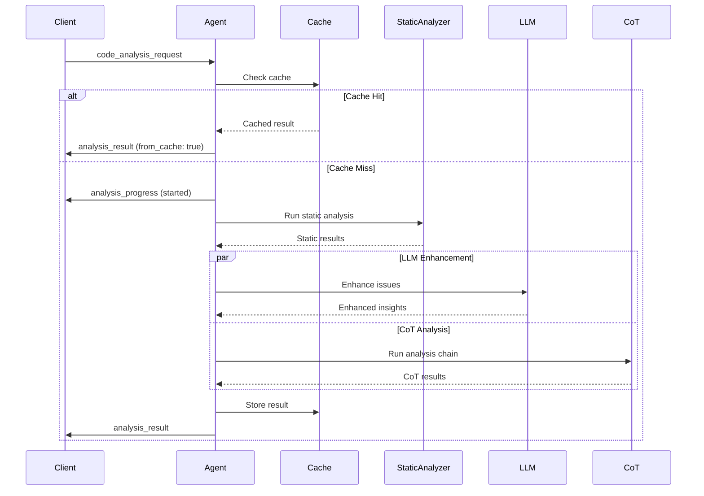
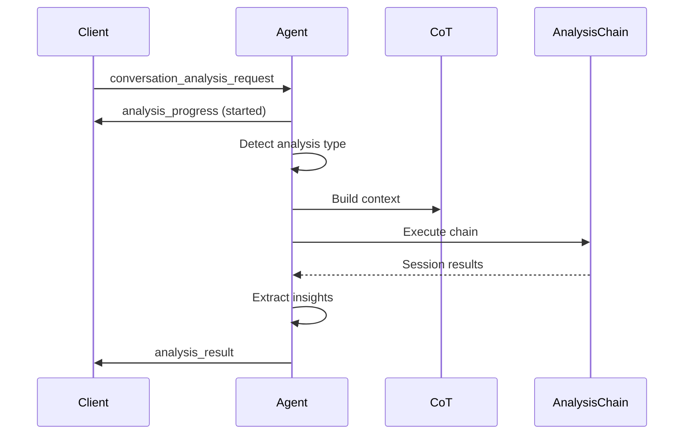

# Code Analysis Agent - Signal Documentation

## Overview

The Code Analysis Agent processes code analysis requests asynchronously using a signal-based architecture. It supports both direct file analysis and conversational code analysis.

## Input Signals

### code_analysis_request

Requests analysis of a specific file.

```json
{
  "type": "code_analysis_request",
  "data": {
    "file_path": "/path/to/file.ex",
    "options": {
      "enhance_with_llm": true,
      "analyzers": ["static", "security", "style"]
    },
    "request_id": "unique_request_id",
    "provider": "openai",
    "model": "gpt-4",
    "user_id": "user_123"
  }
}
```

**Fields:**
- `file_path` (required): Absolute path to the file to analyze
- `options` (optional): Analysis configuration
  - `enhance_with_llm`: Whether to enhance results with LLM insights
  - `analyzers`: List of analyzers to run (defaults to all)
- `request_id` (required): Unique identifier for tracking the request
- `provider` (required for LLM features): LLM provider
- `model` (required for LLM features): LLM model to use
- `user_id` (required): User identifier for LLM calls

### conversation_analysis_request

Requests analysis within a conversational context.

```json
{
  "type": "conversation_analysis_request",
  "data": {
    "query": "Can you analyze this code for security vulnerabilities?",
    "code": "def process(input), do: File.read!(input)",
    "context": {
      "language": "elixir",
      "session_id": "session_123"
    },
    "request_id": "unique_request_id",
    "provider": "anthropic",
    "model": "claude-3-sonnet",
    "user_id": "user_456"
  }
}
```

**Fields:**
- `query` (required): The analysis question/request
- `code` (optional): Code snippet to analyze
- `context` (optional): Additional context
- `request_id` (required): Unique identifier
- `provider` (required): LLM provider
- `model` (required): LLM model
- `user_id` (required): User identifier

### get_analysis_metrics

Requests current analysis metrics.

```json
{
  "type": "get_analysis_metrics"
}
```

## Output Signals

### analysis_result

Emitted when analysis is complete.

```json
{
  "type": "analysis_result",
  "data": {
    "request_id": "unique_request_id",
    "result": {
      "file": "/path/to/file.ex",
      "language": "elixir",
      "issues": [
        {
          "type": "warning",
          "category": "unused_variable",
          "message": "Unused variable: _temp",
          "line": 42,
          "column": 5,
          "enhanced": true,
          "explanation": "This variable is assigned but never used..."
        }
      ],
      "metrics": {
        "total_issues": 3,
        "by_type": {"warning": 2, "info": 1},
        "by_category": {"unused_variable": 1, "documentation": 2}
      },
      "summary": "Found 3 issues: 0 errors, 2 warnings.",
      "patterns": ["Frequent use of anonymous functions"],
      "suggestions": ["Consider adding @doc attributes"],
      "priorities": {
        "critical": [],
        "high": ["Add error handling"],
        "medium": ["Improve documentation"],
        "low": ["Code formatting"]
      }
    },
    "from_cache": false
  }
}
```

### analysis_progress

Progress updates during analysis.

```json
{
  "type": "analysis_progress",
  "data": {
    "request_id": "unique_request_id",
    "status": "enhancing",
    "message": "Running LLM enhancement..."
  }
}
```

**Status values:**
- `started`: Analysis has begun
- `static_complete`: Static analysis finished
- `enhancing`: LLM enhancement in progress
- `cot_analysis`: CoT chain analysis running

### enhancement_complete

Emitted when LLM enhancement finishes.

```json
{
  "type": "enhancement_complete",
  "data": {
    "request_id": "unique_request_id",
    "enhanced_count": 5
  }
}
```

### analysis_metrics

Current metrics data.

```json
{
  "type": "analysis_metrics",
  "data": {
    "metrics": {
      "files_analyzed": 150,
      "conversations_analyzed": 45,
      "total_issues": 523,
      "analysis_time_ms": 125000,
      "cache_hits": 89,
      "llm_enhancements": 67
    },
    "queue_length": 2,
    "active_analyses": 1,
    "cache_size": 50
  }
}
```

## Analysis Flow Examples

### File Analysis Flow



### Conversation Analysis Flow



## Error Handling

If an error occurs during analysis, the `analysis_result` signal will include an error field:

```json
{
  "type": "analysis_result",
  "data": {
    "request_id": "unique_request_id",
    "error": "File not found: /path/to/missing.ex"
  }
}
```

## Cache Behavior

- File analyses are cached based on file path and options
- Cache entries expire after 5 minutes (configurable)
- Conversation analyses are not cached
- Cache hits return immediately without processing