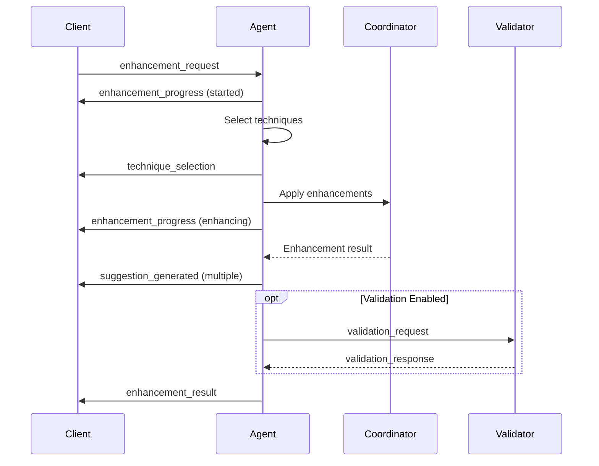
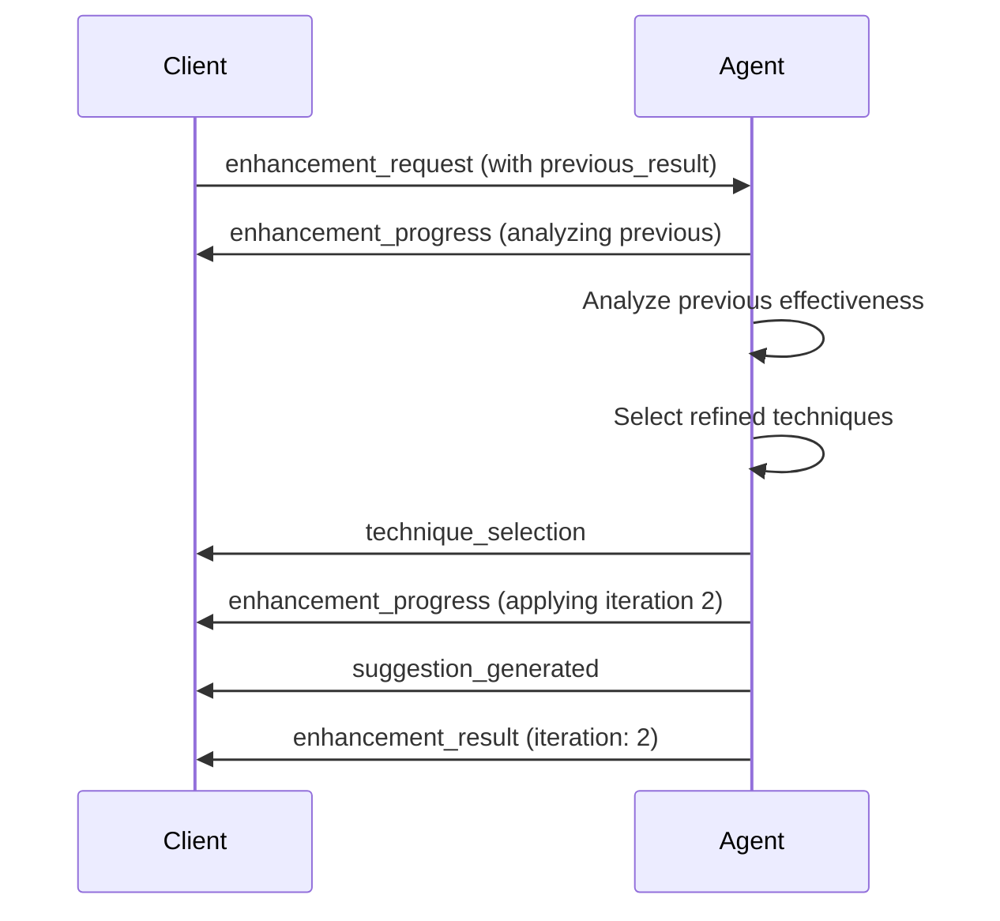
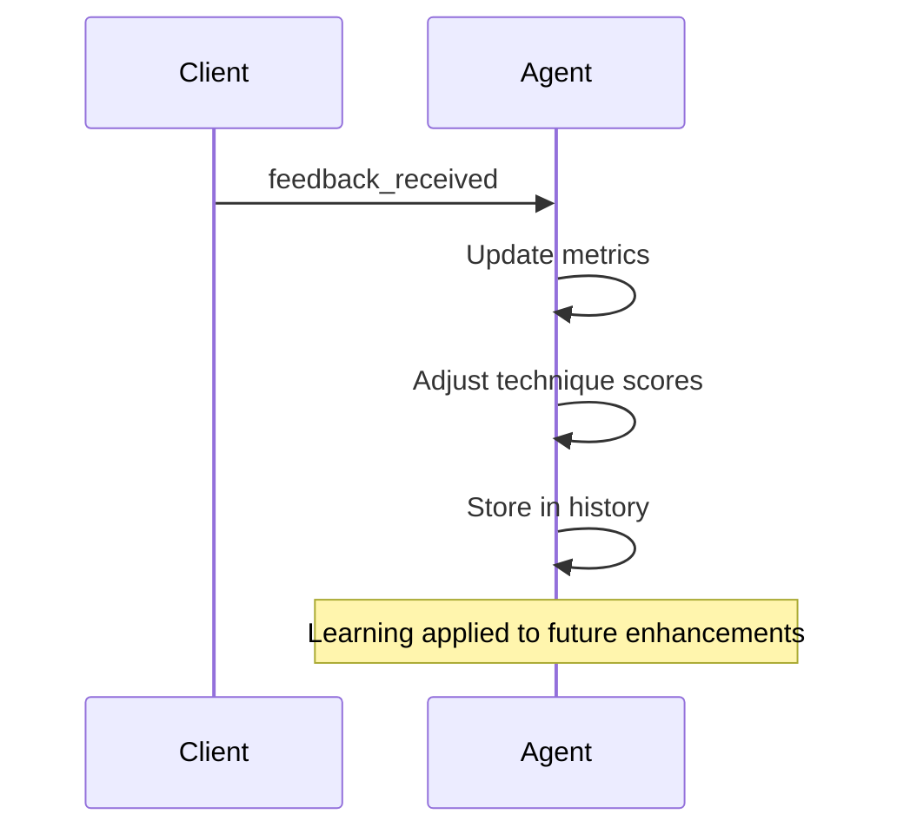

# Enhancement Conversation Agent - Signal Documentation

## Overview

The Enhancement Conversation Agent manages code and content enhancement requests through asynchronous signal-based communication. It coordinates with the existing enhancement system to apply techniques like Chain-of-Thought (CoT), Retrieval-Augmented Generation (RAG), and self-correction.

## Input Signals

### enhancement_request

Requests enhancement of content or code.

```json
{
  "type": "enhancement_request",
  "data": {
    "content": "def hello do\n  \"world\"\nend",
    "context": {
      "language": "elixir",
      "project": "my_app"
    },
    "preferences": {
      "techniques": ["cot", "self_correction"],
      "max_iterations": 3,
      "pipeline_type": "sequential",
      "validation_enabled": true,
      "include_tests": true
    },
    "request_id": "unique_request_id",
    "previous_result": {
      "iteration": 1,
      "enhanced_content": "previous enhancement"
    }
  }
}
```

**Fields:**
- `content` (required): The content to enhance
- `context` (optional): Additional context about the content
- `preferences` (optional): Enhancement preferences
  - `techniques`: Specific techniques to use (overrides auto-selection)
  - `max_iterations`: Maximum enhancement iterations
  - `pipeline_type`: "sequential", "parallel", or "conditional"
  - `validation_enabled`: Whether to validate suggestions
- `request_id` (required): Unique identifier for tracking
- `previous_result` (optional): For iterative enhancements

### feedback_received

User feedback on enhancement suggestions.

```json
{
  "type": "feedback_received",
  "data": {
    "request_id": "unique_request_id",
    "suggestion_id": "sug_123",
    "feedback": {
      "rating": 5,
      "comment": "Very helpful suggestion!"
    },
    "accepted": true
  }
}
```

**Fields:**
- `request_id` (required): Original request ID
- `suggestion_id` (required): ID of the suggestion
- `feedback` (required): Feedback details
  - `rating`: Numeric rating (1-5) or "positive"/"negative"
  - `comment`: Optional text feedback
- `accepted` (required): Whether suggestion was accepted

### validation_response

Results from validation requests.

```json
{
  "type": "validation_response",
  "data": {
    "request_id": "unique_request_id",
    "validation_id": "val_456",
    "results": {
      "syntax_valid": true,
      "tests_pass": true,
      "warnings": [],
      "errors": []
    }
  }
}
```

### get_enhancement_metrics

Request current enhancement metrics.

```json
{
  "type": "get_enhancement_metrics"
}
```

## Output Signals

### enhancement_result

Final enhanced content with suggestions.

```json
{
  "type": "enhancement_result",
  "data": {
    "request_id": "unique_request_id",
    "enhanced_content": "Enhanced version of the content",
    "original_content": "Original content",
    "suggestions": [
      {
        "id": "sug_123",
        "type": "reasoning",
        "description": "Added step-by-step reasoning to improve clarity",
        "impact": "medium",
        "confidence": 0.75,
        "technique": "chain_of_thought"
      },
      {
        "id": "sug_456",
        "type": "correction",
        "description": "Fixed logical error in condition",
        "impact": "high",
        "confidence": 0.9,
        "technique": "self_correction"
      }
    ],
    "techniques_applied": ["cot", "self_correction"],
    "metrics": {
      "quality_improvement": 0.8,
      "corrections": [
        {"description": "Fixed syntax error", "confidence": 0.95}
      ]
    },
    "iteration": 1,
    "validation_pending": false
  }
}
```

### enhancement_progress

Progress updates during enhancement.

```json
{
  "type": "enhancement_progress",
  "data": {
    "request_id": "unique_request_id",
    "status": "enhancing",
    "message": "Applying 2 enhancement techniques"
  }
}
```

**Status values:**
- `started`: Analysis begun
- `analyzing`: Analyzing content
- `enhancing`: Applying techniques
- `validating`: Running validation
- `completed`: Enhancement finished

### suggestion_generated

Individual enhancement suggestion.

```json
{
  "type": "suggestion_generated",
  "data": {
    "request_id": "unique_request_id",
    "suggestion": {
      "id": "sug_789",
      "type": "context",
      "description": "Enhanced with relevant context from 3 sources",
      "impact": "medium",
      "confidence": 0.7,
      "technique": "rag",
      "sources": [
        {"type": "documentation", "relevance": 0.9},
        {"type": "similar_code", "relevance": 0.8}
      ]
    }
  }
}
```

### technique_selection

Selected enhancement techniques.

```json
{
  "type": "technique_selection",
  "data": {
    "request_id": "unique_request_id",
    "techniques": ["cot", "self_correction"],
    "reason": "Selected based on content type and preferences"
  }
}
```

### validation_request

Request validation of enhancements.

```json
{
  "type": "validation_request",
  "data": {
    "request_id": "unique_request_id",
    "validation_id": "val_123",
    "suggestion_id": "sug_456",
    "content": "Enhanced code content",
    "suggestion": {
      "id": "sug_456",
      "type": "correction",
      "description": "Fixed syntax error"
    },
    "validation_type": "syntax_and_tests"
  }
}
```

### enhancement_metrics

Current enhancement metrics.

```json
{
  "type": "enhancement_metrics",
  "data": {
    "metrics": {
      "total_enhancements": 150,
      "suggestions_generated": 523,
      "suggestions_accepted": 412,
      "avg_improvement_score": 0.78,
      "technique_effectiveness": {
        "cot": 0.82,
        "self_correction": 0.75,
        "rag": 0.69
      }
    },
    "active_enhancements": 2,
    "history_size": 150,
    "cache_size": 45,
    "config": {
      "default_techniques": ["cot", "self_correction"],
      "max_suggestions": 5,
      "validation_enabled": true
    }
  }
}
```

## Enhancement Flow Examples

### Basic Enhancement Flow



### Iterative Enhancement Flow



### Feedback Learning Flow



## Suggestion Types

- `reasoning`: Added logical reasoning or explanations
- `correction`: Fixed errors or issues
- `context`: Added relevant context or references
- `expansion`: Expanded content with details
- `refactoring`: Code structure improvements
- `optimization`: Performance improvements
- `documentation`: Added or improved documentation

## Impact Levels

- `high`: Critical improvements (bugs, security, major clarity)
- `medium`: Significant improvements (performance, structure)
- `low`: Minor improvements (style, formatting)

## Validation Types

- `syntax_and_tests`: Validates syntax and runs tests
- `syntax_only`: Only validates syntax
- `impact_analysis`: Analyzes impact of changes
- `security_check`: Security vulnerability scanning