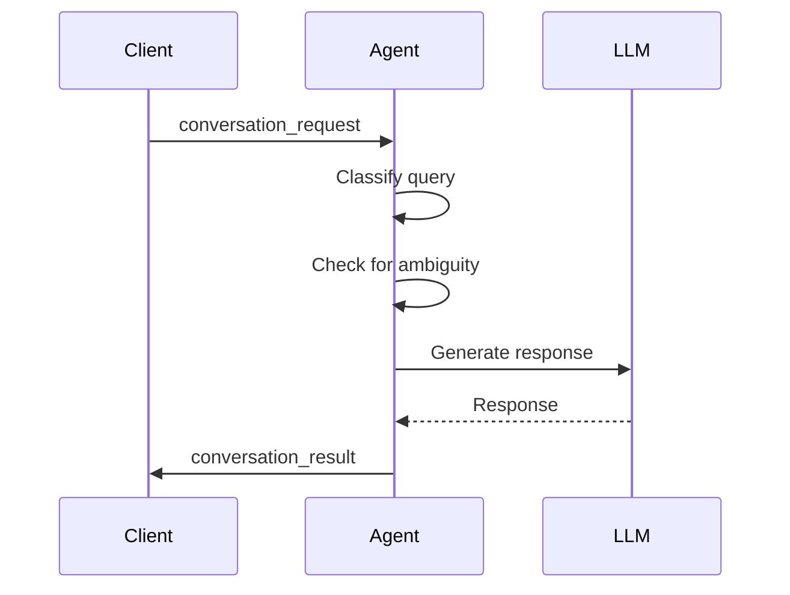
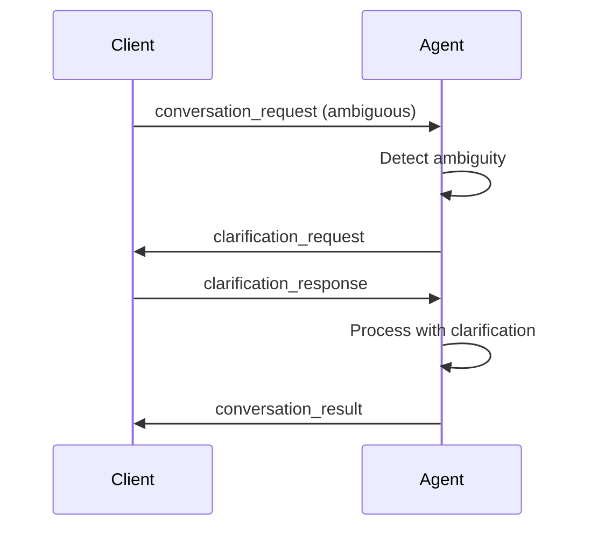
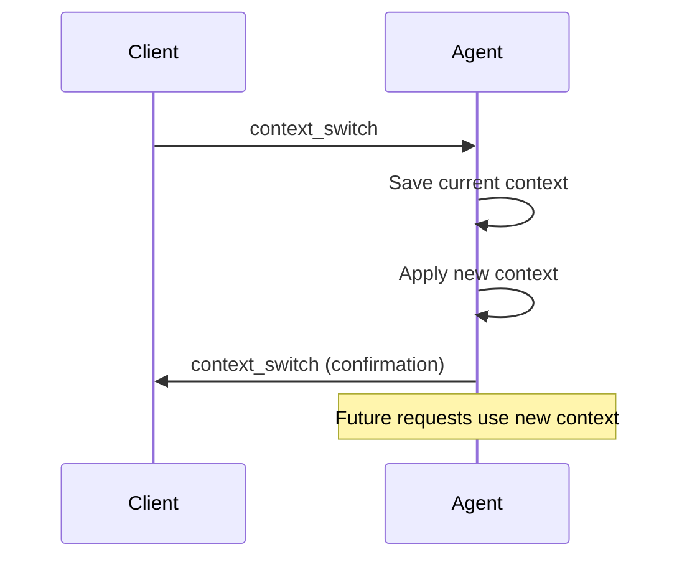
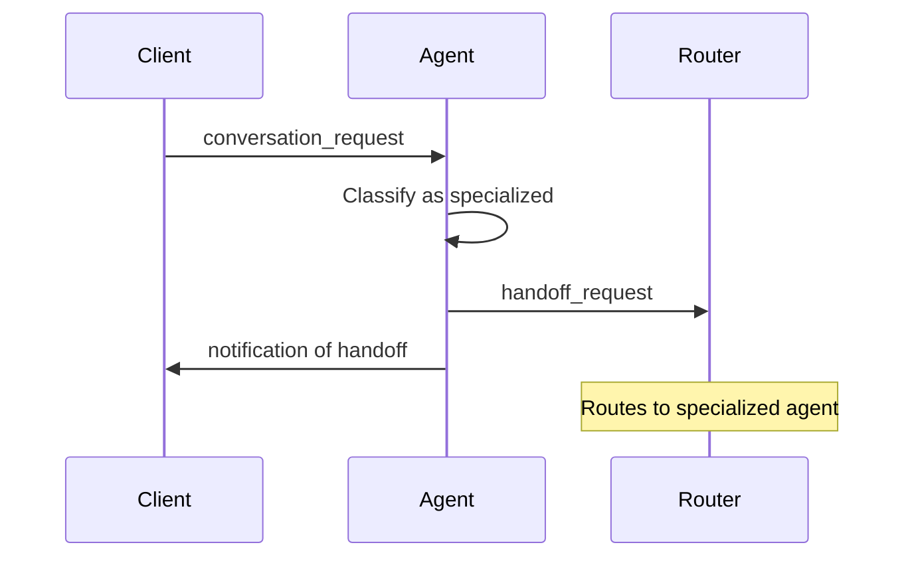

# General Conversation Agent - Signal Documentation

## Overview

The General Conversation Agent handles various types of conversations through flexible signal-based communication. It manages conversation context, detects topic changes, and can hand off to specialized agents when needed.

## Input Signals

### conversation_request

Initiates or continues a general conversation.

```json
{
  "type": "conversation_request",
  "data": {
    "query": "What is Elixir and why is it popular?",
    "conversation_id": "conv_unique_id",
    "context": {
      "style": "technical",
      "topic": "programming languages",
      "user_preferences": {}
    },
    "provider": "openai",
    "model": "gpt-4",
    "user_id": "user_123",
    "messages": [
      {"role": "user", "content": "Previous message"},
      {"role": "assistant", "content": "Previous response"}
    ]
  }
}
```

**Fields:**
- `query` (required): The user's question or statement
- `conversation_id` (required): Unique identifier for the conversation
- `context` (optional): Conversation context
  - `style`: "technical", "casual", "professional"
  - `topic`: Current conversation topic
- `provider` (required): LLM provider
- `model` (required): LLM model to use
- `user_id` (required): User identifier
- `messages` (optional): Conversation history

### context_switch

Switches the conversation context.

```json
{
  "type": "context_switch",
  "data": {
    "conversation_id": "conv_unique_id",
    "new_context": {
      "topic": "web frameworks",
      "style": "casual"
    },
    "preserve_history": true
  }
}
```

**Fields:**
- `conversation_id` (required): Conversation to switch context for
- `new_context` (required): New context to apply
- `preserve_history` (required): Whether to save current context to stack

### clarification_response

Response to a clarification request.

```json
{
  "type": "clarification_response",
  "data": {
    "conversation_id": "conv_unique_id",
    "clarification": "I meant the Elixir programming language",
    "original_query": "Tell me about it",
    "provider": "openai",
    "model": "gpt-4",
    "user_id": "user_123"
  }
}
```

### get_conversation_metrics

Request current conversation metrics.

```json
{
  "type": "get_conversation_metrics"
}
```

## Output Signals

### conversation_result

Response to a conversation request.

```json
{
  "type": "conversation_result",
  "data": {
    "conversation_id": "conv_unique_id",
    "query": "What is Elixir?",
    "response": "Elixir is a dynamic, functional programming language...",
    "classification": "factual",
    "processing_time_ms": 1250
  }
}
```

**Fields:**
- `conversation_id`: The conversation ID
- `query`: Original query
- `response`: Generated response
- `classification`: Query classification
- `processing_time_ms`: Time taken to process

### clarification_request

Request for clarification when query is ambiguous.

```json
{
  "type": "clarification_request",
  "data": {
    "conversation_id": "conv_unique_id",
    "original_query": "Tell me about it",
    "reason": "Query is ambiguous",
    "suggestions": [
      "Could you provide more context?",
      "What specifically are you referring to?",
      "Can you elaborate on your question?"
    ]
  }
}
```

### topic_change

Notification when conversation topic changes.

```json
{
  "type": "topic_change",
  "data": {
    "conversation_id": "conv_unique_id",
    "new_topic": "distributed systems"
  }
}
```

### context_switch

Confirmation of context switch.

```json
{
  "type": "context_switch",
  "data": {
    "conversation_id": "conv_unique_id",
    "previous_context": {
      "topic": "elixir"
    },
    "new_context": {
      "topic": "phoenix"
    }
  }
}
```

### handoff_request

Request to hand off conversation to specialized agent.

```json
{
  "type": "handoff_request",
  "data": {
    "conversation_id": "conv_unique_id",
    "target_agent": "code_generation",
    "context": {
      "conversation_id": "conv_unique_id",
      "query": "Generate a GenServer module",
      "classification": "code_generation",
      "context": {},
      "history": []
    },
    "reason": "Query requires specialized handling"
  }
}
```

**Target agents:**
- `generation_conversation`: Code generation requests
- `planning_conversation`: Planning requests
- `code_analysis`: Analysis requests
- `problem_solver`: Complex problem solving
- `complex_conversation`: Complex multi-step queries

### conversation_summary

Summary of conversation (generated periodically or on request).

```json
{
  "type": "conversation_summary",
  "data": {
    "conversation_id": "conv_unique_id",
    "summary": "Discussion about Elixir language features and OTP",
    "topics": ["elixir", "otp", "concurrency"],
    "message_count": 15,
    "duration_ms": 300000
  }
}
```

### conversation_metrics

Current conversation metrics.

```json
{
  "type": "conversation_metrics",
  "data": {
    "metrics": {
      "total_conversations": 150,
      "context_switches": 45,
      "clarifications_requested": 23,
      "handoffs": 12,
      "avg_response_time_ms": 1500
    },
    "active_conversations": 5,
    "total_messages": 523,
    "history_size": 100,
    "context_stack_depth": 3,
    "config": {
      "max_history_length": 100,
      "context_timeout_ms": 300000,
      "enable_learning": true,
      "enable_personalization": false
    }
  }
}
```

## Conversation Flow Examples

### Basic Conversation Flow



### Clarification Flow



### Context Switch Flow



### Handoff Flow



## Classification Types

- `simple`: Simple factual queries
- `factual`: Factual information requests
- `creative`: Creative or brainstorming queries
- `brainstorming`: Idea generation
- `complex_problem`: Complex technical problems
- `code_generation`: Code generation requests
- `planning`: Planning requests
- `analysis`: Analysis requests

## Response Strategies

The agent adjusts its response based on:
- Query classification
- Conversation context
- User style preferences
- Topic complexity

Temperature and token limits are adjusted accordingly.