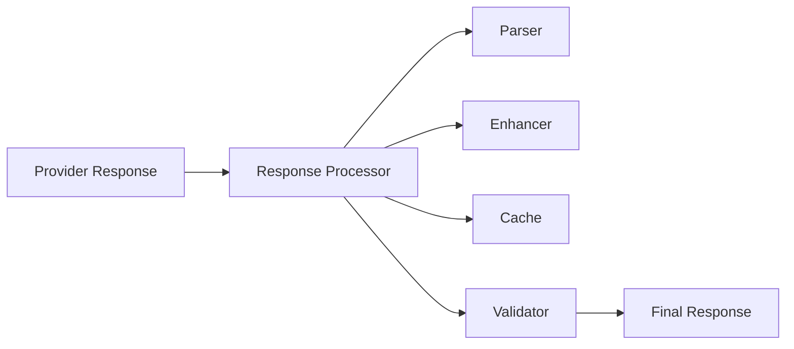

# Feature: Response Processor Agent (15.4.4)

## Overview

The Response Processor Agent is a specialized autonomous agent that handles post-processing of LLM responses, providing parsing, validation, transformation, enhancement, and caching capabilities. This agent serves as the final stage in the LLM pipeline, ensuring responses are properly formatted, validated, and optimized before delivery to end users.

## Requirements Analysis

Based on section 15.4.4 of the refactoring plan, the Response Processor Agent needs to provide:

### 15.4.4.1 Processor Module
- Core agent implementation using RubberDuck.Agents.BaseAgent
- Response parsing logic for various formats (JSON, XML, Markdown, plain text)
- Response validation and quality checks
- Transformation capabilities for different output formats
- Intelligent caching with TTL and invalidation

### 15.4.4.2 Parsing System
- Automatic format detection for incoming responses
- Structured data extraction from unstructured text
- Robust error handling for malformed responses
- Fallback logic for parsing failures
- Streaming support for real-time processing

### 15.4.4.3 Enhancement Pipeline
- Quality assessment and scoring
- Response formatting and beautification
- Content enrichment (links, references, metadata)
- Content filtering and sanitization
- Response compression for efficiency

### 15.4.4.4 Caching Layer
- Multi-level caching strategies (memory, disk, distributed)
- Smart cache invalidation based on content similarity
- Response compression for storage efficiency
- TTL management with configurable expiration
- Distributed caching for multi-node deployments

### 15.4.4.5 Processing Metrics
- Processing time tracking and optimization
- Quality score monitoring and trends
- Cache hit/miss ratio analysis
- Error tracking and categorization
- Performance optimization recommendations

## Architecture Design

### Core Components

1. **ResponseProcessorAgent**: Main agent module handling signal processing
2. **ResponseParser**: Multi-format parsing engine
3. **ResponseEnhancer**: Quality improvement and enrichment pipeline
4. **ResponseCache**: Intelligent caching layer
5. **ResponseMetrics**: Performance monitoring and analytics
6. **ResponseValidator**: Quality and safety validation

### Signal Interface

The agent will handle these signals:
- `process_response`: Main processing pipeline
- `parse_response`: Parse specific format
- `validate_response`: Validate response quality
- `enhance_response`: Apply enhancement pipeline
- `get_cached_response`: Retrieve from cache
- `invalidate_cache`: Remove cached entries
- `get_metrics`: Retrieve processing metrics
- `configure_processor`: Update configuration

### State Management

```elixir
%{
  cache: %{}, # response_hash => cached_response
  metrics: %{}, # processing statistics
  parsers: %{}, # format => parser_module
  enhancers: [], # list of enhancement functions
  validators: [], # list of validation functions
  config: %{
    cache_ttl: 7200,
    max_cache_size: 10000,
    enable_streaming: true,
    quality_threshold: 0.8,
    compression_enabled: true
  }
}
```

## Implementation Plan

### Phase 1: Core Agent and Parsing System
1. Implement ResponseProcessorAgent with BaseAgent
2. Create ResponseParser with multi-format support
3. Implement basic response validation
4. Add caching layer with TTL

### Phase 2: Enhancement Pipeline
1. Build ResponseEnhancer with quality checks
2. Implement content formatting and beautification
3. Add content enrichment capabilities
4. Create filtering and sanitization

### Phase 3: Advanced Features
1. Implement streaming response processing
2. Add distributed caching support
3. Create comprehensive metrics collection
4. Build optimization recommendations

### Phase 4: Performance and Monitoring
1. Implement advanced caching strategies
2. Add real-time performance monitoring
3. Create optimization analytics
4. Build alerting and notification system

## Data Structures

### ProcessedResponse
```elixir
defstruct [
  :id,
  :original_response,
  :parsed_content,
  :format,
  :quality_score,
  :metadata,
  :enhanced_content,
  :processing_time,
  :cache_key,
  :validation_results,
  :created_at,
  :provider,
  :model
]
```

### ResponseMetrics
```elixir
defstruct [
  :total_processed,
  :avg_processing_time,
  :quality_distribution,
  :format_breakdown,
  :cache_hit_rate,
  :error_rate,
  :enhancement_stats,
  :validation_stats
]
```

## Parsing System Architecture

### Format Detection Engine

The system will automatically detect response formats:
- **JSON**: Structured data responses
- **XML**: Markup-based responses
- **Markdown**: Documentation and formatted text
- **HTML**: Web content responses
- **Plain Text**: Unstructured text responses
- **Code**: Programming language responses
- **YAML**: Configuration and data responses

### Parsing Strategies

1. **Structural Parsing**: For JSON, XML, YAML
2. **Pattern-Based Parsing**: Using regex and rules
3. **ML-Based Parsing**: For complex unstructured content
4. **Hybrid Parsing**: Combining multiple approaches

### Error Handling

- Graceful degradation for malformed responses
- Fallback to plain text when structured parsing fails
- Partial parsing with error annotations
- Recovery mechanisms for common formatting issues

## Enhancement Pipeline

### Quality Assessment
- Content completeness checking
- Factual consistency validation
- Readability scoring
- Relevance assessment

### Content Enhancement
- Formatting standardization
- Link enrichment and validation
- Reference addition
- Metadata augmentation
- Code syntax highlighting

### Filtering and Sanitization
- Harmful content removal
- PII detection and masking
- Profanity filtering
- Spam detection
- Bias detection and mitigation

## Caching Strategy

### Cache Levels
1. **L1 Cache**: In-memory for hot responses (< 1ms access)
2. **L2 Cache**: Local disk for warm responses (< 10ms access)
3. **L3 Cache**: Distributed cache for cold responses (< 100ms access)

### Cache Key Generation
Based on:
- Response content hash
- Processing configuration
- Enhancement settings
- Format requirements

### Invalidation Strategies
- **Time-based**: TTL expiration
- **Content-based**: Similarity threshold
- **Event-based**: Manual invalidation
- **Usage-based**: LRU eviction

## Performance Characteristics

### Processing Targets

| Operation | Target Latency | Throughput Target |
|-----------|---------------|-------------------|
| Parse JSON | < 5ms | > 1000 req/sec |
| Parse Markdown | < 10ms | > 500 req/sec |
| Enhancement | < 50ms | > 100 req/sec |
| Cache Hit | < 1ms | > 5000 req/sec |
| Quality Check | < 20ms | > 200 req/sec |

### Scalability Design
- Horizontal scaling with distributed processing
- Async processing for non-critical enhancements
- Streaming support for large responses
- Memory-efficient parsing for large documents

## Security and Safety

### Content Safety
- Harmful content detection and filtering
- PII identification and protection
- Malicious code detection
- Content authenticity verification

### System Security
- Input validation and sanitization
- Rate limiting and abuse protection
- Audit logging for all operations
- Secure caching with encryption

## Integration Points

### LLM Provider Integration


### Signal Flow
- Receives `provider_response` from LLM provider agents
- Emits `response_processed` with enhanced content
- Handles `get_cached_response` for performance
- Sends `processing_metrics` for monitoring

## Testing Strategy

### Unit Tests
- Parser tests for each format
- Enhancement function tests
- Cache operation tests
- Validation rule tests

### Integration Tests
- End-to-end processing pipeline
- Multi-format response handling
- Cache invalidation scenarios
- Error recovery testing

### Performance Tests
- Latency benchmarks
- Throughput measurements
- Memory usage profiling
- Cache effectiveness analysis

### Load Tests
- Concurrent processing capacity
- Cache performance under load
- Error rate under stress
- Recovery time measurement

## Success Criteria

- [ ] Agent responds to all defined signals correctly
- [ ] Parsing supports 7+ response formats reliably
- [ ] Enhancement pipeline improves response quality measurably
- [ ] Caching achieves >80% hit rate with <5ms average access time
- [ ] Processing latency <50ms for 95th percentile
- [ ] System handles >1000 concurrent requests
- [ ] All tests pass with >95% coverage
- [ ] Memory usage remains stable under load

## File Structure

```
lib/rubber_duck/agents/
├── response_processor_agent.ex       # Main agent module
├── response/
│   ├── parser.ex                     # Multi-format parsing
│   ├── enhancer.ex                   # Enhancement pipeline
│   ├── cache.ex                      # Caching layer
│   ├── validator.ex                  # Quality validation
│   ├── metrics.ex                    # Performance tracking
│   └── formats/
│       ├── json_parser.ex            # JSON parsing
│       ├── markdown_parser.ex        # Markdown parsing
│       ├── xml_parser.ex             # XML parsing
│       └── text_parser.ex            # Plain text parsing

test/rubber_duck/agents/
├── response_processor_agent_test.exs # Main tests
└── response/
    ├── parser_test.exs               # Parser tests
    ├── enhancer_test.exs             # Enhancement tests
    ├── cache_test.exs                # Cache tests
    └── formats/
        ├── json_parser_test.exs      # Format-specific tests
        └── markdown_parser_test.exs

docs/agents/
└── response_processor_architecture.md # Architecture docs
```

## Timeline

- **Week 1**: Core agent and basic parsing system
- **Week 2**: Enhancement pipeline and validation
- **Week 3**: Advanced caching and metrics
- **Week 4**: Performance optimization and monitoring
- **Week 5**: Testing, documentation, and integration

## Dependencies

- RubberDuck.Agents.BaseAgent (core agent functionality)
- LLM provider agents (for response input)
- JSON/XML parsing libraries
- Caching infrastructure
- Metrics collection system

## Future Enhancements

### Advanced Features

1. **AI-Powered Enhancement**
   - ML-based quality scoring
   - Automatic response improvement
   - Intelligent content enrichment
   - Personalized response formatting

2. **Real-time Processing**
   - Streaming response processing
   - Live quality monitoring
   - Dynamic enhancement adjustment
   - Real-time cache optimization

3. **Advanced Analytics**
   - Response quality trends
   - Performance anomaly detection
   - Predictive caching
   - Usage pattern analysis

4. **Multi-modal Support**
   - Image response processing
   - Audio response handling
   - Video content processing
   - Mixed-media responses

### Technical Improvements

- **Edge Caching**: CDN integration for global distribution
- **GPU Acceleration**: Hardware acceleration for ML tasks
- **Advanced Compression**: Context-aware compression algorithms
- **Intelligent Routing**: Response-type specific processing paths

## Development Guidelines

### Creating New Parsers

1. Implement the `ResponseParser` behavior
2. Add comprehensive error handling
3. Include format validation
4. Add performance benchmarks
5. Document supported features

### Adding Enhancement Functions

1. Follow the enhancement pipeline pattern
2. Maintain processing order dependencies
3. Add configuration options
4. Include quality metrics
5. Test with various response types

### Performance Optimization

1. Profile critical paths regularly
2. Implement caching at appropriate levels
3. Use streaming for large responses
4. Monitor memory usage patterns
5. Optimize for common use cases

This architecture provides a comprehensive foundation for response processing in the RubberDuck system, ensuring high-quality, well-formatted responses while maintaining excellent performance and reliability.